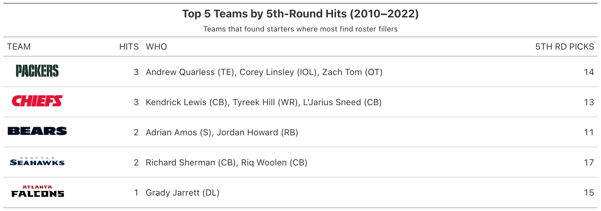
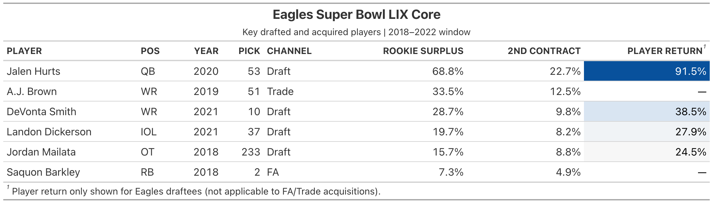
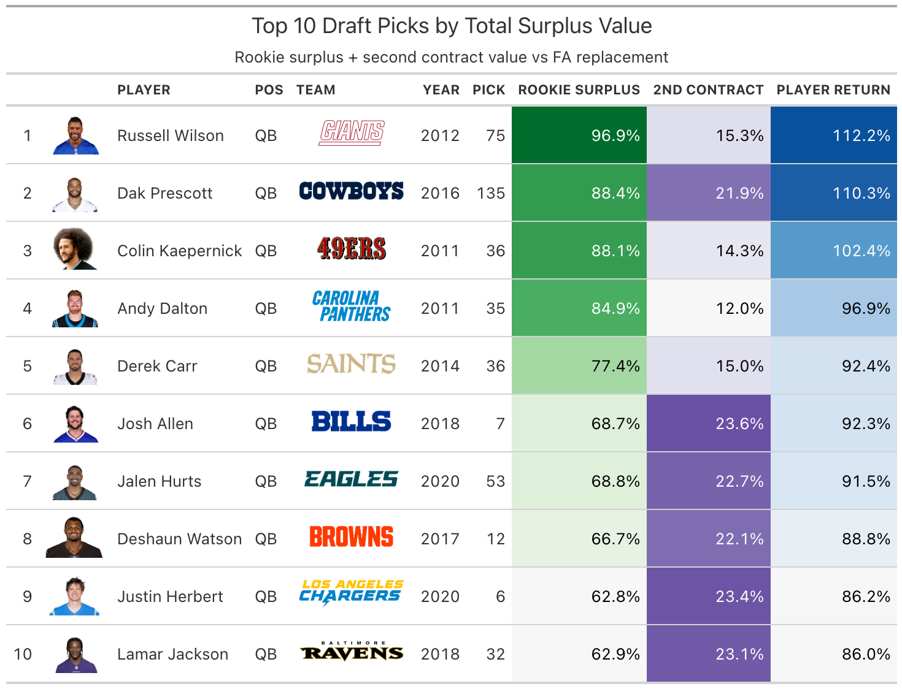
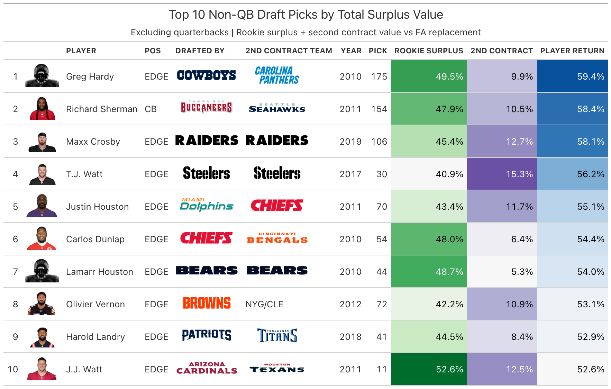
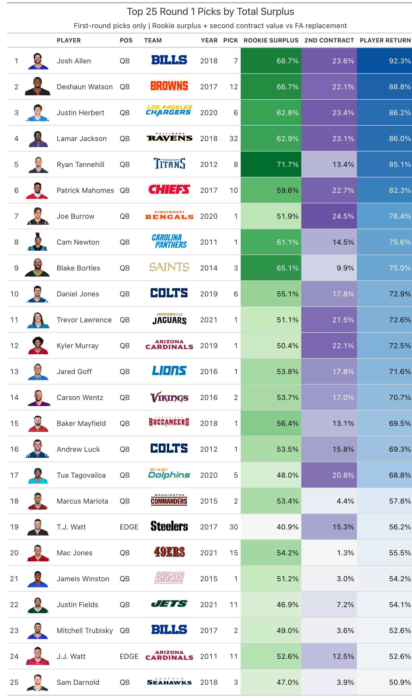

```{css mobile-styles, echo=FALSE}
img {
  max-width: 100%;
  height: auto;
}
.main-container {
  max-width: 960px;
}
table {
  display: block;
  overflow-x: auto;
  white-space: nowrap;
}
@media (max-width: 768px) {
  .main-container {
    max-width: 100% !important;
    padding: 8px !important;
  }
  img {
    width: 100% !important;
    height: auto !important;
  }
  table, .gt_table {
    font-size: 11px !important;
  }
  h1 { font-size: 1.5em; }
  h2 { font-size: 1.25em; }
  h3 { font-size: 1.1em; }
  p, li { font-size: 14px; }
}
```

```{r setup, include=FALSE}
knitr::opts_chunk$set(
  echo = FALSE, warning = FALSE, message = FALSE,
  fig.width = 8, fig.height = 6, dpi = 150,
  fig.retina = 2,
  fig.path = "charts/"
)
library(tidyverse)
library(arrow)
library(scales)
library(ggridges)
library(gt)
library(nflplotR)
library(nflreadr)

pos_colors <- c(
  "QB" = "#E41A1C", "RB" = "#377EB8", "WR" = "#4DAF4A", "TE" = "#984EA3",
  "OT" = "#FF7F00", "IOL" = "#B8860B", "EDGE" = "#A65628", "DL" = "#F781BF",
  "LB" = "#999999", "CB" = "#66C2A5", "S" = "#FC8D62"
)

tier_order <- c("Top 10", "Late 1st", "Round 2", "Round 3", "Rounds 4-7")
key_positions <- c("QB", "RB", "WR", "TE", "EDGE", "OT")
```

```{r load-data}
df <- read_parquet("data/draft_sharpe_analysis.parquet")
sharpe <- read_csv("output/sharpe_ratios.csv", show_col_types = FALSE)
fa_replacement <- read_csv("output/fa_replacement.csv", show_col_types = FALSE)
player_lookup <- read_csv("output/player_lookup.csv", show_col_types = FALSE)

sharpe <- sharpe %>% mutate(tier = factor(tier, levels = tier_order))
df <- df %>% mutate(tier = factor(tier, levels = tier_order))
player_lookup <- player_lookup %>% mutate(tier = factor(tier, levels = tier_order))

# Filter to players with at least 4 years for fair Sharpe comparison
df_eligible <- df %>% filter(season <= 2022)

elite_threshold <- quantile(df_eligible$player_return[df_eligible$player_return > 0], 0.90)

# Load headshots and most recent team for gt tables
rosters <- load_rosters(seasons = 2012:2025)

headshots <- rosters %>%
  select(gsis_id, headshot_url) %>%
  distinct(gsis_id, .keep_all = TRUE)

recent_teams <- rosters %>%
  filter(!is.na(gsis_id), gsis_id != "") %>%
  group_by(gsis_id) %>%
  slice_max(season, n = 1, with_ties = FALSE) %>%
  ungroup() %>%
  select(gsis_id, recent_team = team)

# Patch known second contract values for players whose PFR draft position
# doesn't match OTC contract position (EDGE drafted, DL in OTC)
leaderboard_patches <- tribble(
  ~pfr_player_name,    ~second_apy_cap_pct_fix,
  "J.J. Watt",         0.125,   # 2014, IDL in OTC
  "DeForest Buckner",   0.106,   # 2020, IDL in OTC
  "Cameron Heyward",    0.073,   # 2015, IDL in OTC
  "Leonard Williams",   0.081,   # 2020, IDL in OTC
  "Jonathan Allen",     0.099,   # 2021, IDL in OTC
  "Stephon Tuitt",      0.072    # 2017, IDL in OTC
)
player_lookup <- player_lookup %>%
  left_join(leaderboard_patches, by = "pfr_player_name") %>%
  mutate(second_apy_cap_pct = coalesce(second_apy_cap_pct_fix, second_apy_cap_pct)) %>%
  select(-second_apy_cap_pct_fix)

player_lookup <- player_lookup %>%
  left_join(headshots, by = "gsis_id") %>%
  left_join(recent_teams, by = "gsis_id") %>%
  mutate(team = coalesce(recent_team, team)) %>%
  select(-recent_team)
```

## TL;DR

I built a quasi-Sharpe ratio for NFL draft picks — a risk-adjusted measure of what each
position is worth at each draft slot, accounting for rookie contract surplus, second-contract
value, and supply-controlled free agency replacement costs. The model suggests that **QB
produces the strongest risk-adjusted returns in the top 10**, while OT and EDGE peak in the
late first round and WR offers the best value in Round 2. RB shows negative returns across
all tiers in this framework — driven by cheap FA alternatives and a low contract ceiling.
A large share of the total return from any draft pick comes from rookie contract surplus —
getting starter production at a fraction of free agency cost for 4 years — rather than the
second contract itself. These findings come with important caveats (see Assumptions at the
end): snap share is an imperfect proxy for production, the model doesn't capture positional
scarcity or team-specific needs, and some sample sizes are small.

## Should a Team Love Love at #4 Overall?

Mock drafts have Jeremiah Love going as high as [**#4 overall**](https://grindingthemocks.shinyapps.io/Dashboard/). He's been mocked to RB-needy teams like the Titans, Cardinals, Commanders, and Giants. These are all teams with top-10 picks that many would argue are not "a running back away."

Analytic intuition says that spending premium draft capital on a "non-premium" position like RB is a horrible idea. On the other side, others cite Love's elite prospect profile and the impact a running back like Saquon Barkley can have on a team's Super Bowl run (see the [Eagles' Super Bowl LIX victory in 2024](https://en.wikipedia.org/wiki/Super_Bowl_LIX)).

In Part 1 of this series, I'll lean more into the analytics side of things — empirically defining what a "hit" means while building my own version of a [Sharpe ratio](https://en.wikipedia.org/wiki/Sharpe_ratio), a risk-adjusted return metric originally used in finance to evaluate investments relative to their volatility. In [Part 2](counter_analysis.html), we'll address some of the shortcomings of the Sharpe ratio to round out the argument about where exactly it makes sense to take a running back like Jeremiah Love. By the end of the series, hopefully there's a better understanding of what it means to successfully make the leap from college to pros across all position groups, how the actual NFL market views different positions, and how different teams approach the NFL draft.

---

## The Setup

In the last few years, much has been made about the value of the running back position. ["Running backs don't matter"](https://rbsdm.com/) has become a battle cry of sorts for the analytics community. The discourse on whether Jeremiah Love is worth a top-5 pick has [ignited weeks before the draft](https://x.com/minakimes/status/2041543125831926051?s=20).

Essentially, one side of the aisle says the market is the market and spending a premium pick on a running back doesn't make sense given how cheap it is to find starter-level talent in free agency. The other says that truly elite talent has an on-field impact that the market and the nerds don't understand because they didn't play the game.

Let's take a step back and first do our best to actually put some numbers to what the nerds are talking about. To quantify a few aspects of what it means to contribute to the NFL and what value the market places on different positions. To do that, we need to stand on the shoulders of giants.

- **Timo Riske's hit rate methodology** ([PFF, 2022](https://www.pff.com/news/draft-what-historical-hit-rates-reveal-about-positional-success)): Riske defined what a draft "hit" means. A hit in his framework is a player whose snap share over their first 4 seasons exceeds a fraction of the positional baseline. I tighten his original 2/3 threshold to 75% to set a higher bar: this analysis cares about players who are on the field *more* than a replacement-level player during their rookie contract and play to a level where they earn a top-of-market second contract. Those thresholds are lofty, but they help us evaluate what kinds of players should be taken in the first round. Snap % is averaged over ALL expected games (including seasons not played as zero), so injuries and busts are properly penalized.

- **Brill & Wyner (2024)** ([arXiv:2407.00730](https://arxiv.org/abs/2407.00730), with analysis popularized by **Eric Eager** at PFF): Their key insight is that draft pick value is **nonlinear** and variance decays convexly across rounds, meaning earlier picks have fatter right tails. I operationalize this through the elite probability component of the Sharpe ratio: P(elite) captures the right-tail upside that a simple average would miss. Where Brill & Wyner measured upside through career approximate value, I extend it with cap-normalized contract data to make cross-era and cross-position comparisons possible, thereby capturing who the market deems as a truly valuable player.

- **Salary data** from [OverTheCap](https://overthecap.com/contracts) via [nflreadr](https://nflreadr.nflverse.com/). All contract values normalized to % of salary cap to control for cap inflation across eras.

My contribution is combining these frameworks into a single risk-adjusted metric (the quasi-Sharpe ratio) and adding two new dimensions: **rookie contract surplus** (the hidden majority of draft value) and **supply-controlled FA replacement** (because certain positions in high demand have fewer starting-level players available in free agency).

**Why 2022?** A fair evaluation requires at least 4 NFL seasons. Enough to complete a rookie deal and either earn a second contract or wash out. Players drafted after 2022 haven't had that runway yet, so including them would bias results toward high rookie surplus and $0 second contracts. By stopping at 2022, every player in the dataset has had a real chance to prove (or not prove) their value.

## What Is a "Hit"?

Before building the Sharpe ratio, let's first introduce the idea of a draft "hit" — the foundation everything else rests on. I classify a player as a "hit" if they play at least 75% as much as an established starter at their position over their first 4 NFL seasons. The threshold varies by position because not every position plays every snap:

| Position | What a starter plays | Hit threshold (75% of that) | What it means |
|---|---|---|---|
| IOL | ~100% of snaps | 75% | On the field nearly every play for 3+ years |
| OT | ~97% | 73% | Same — linemen don't rotate |
| S | ~95% | 71% | Safeties play almost every defensive snap |
| LB / CB | ~92% | 69% | Occasionally rotate in sub packages |
| WR | ~85% | 64% | Come off in heavy sets and some run formations |
| QB | ~83% | 62% | Starters play every snap when healthy — injuries drive this down |
| EDGE | ~81% | 61% | Rotate with other pass rushers on some downs |
| DL | ~72% | 54% | Heavy rotation — even stars share snaps with the line |
| TE | ~71% | 53% | Many offenses rotate TEs situationally |
| RB | ~56% | 42% | Even a bellcow comes off for passing downs and in committee |

Snap % is averaged over **all expected games** across 4 seasons — missed games due to injury count as zeros, so availability matters. A player who tears their ACL and misses a full season still clears the threshold at every position if they're a starter when healthy (75% of snaps played × 3/4 seasons ≈ 56%).

```{r hit-rate-by-round, fig.height=6}
round_hits <- df_eligible %>%
  mutate(round = case_when(
    pick <= 32 ~ "Round 1",
    pick <= 64 ~ "Round 2",
    pick <= 100 ~ "Round 3",
    pick <= 135 ~ "Round 4",
    pick <= 170 ~ "Round 5",
    pick <= 215 ~ "Round 6",
    TRUE ~ "Round 7"
  )) %>%
  mutate(round = factor(round, levels = paste("Round", 1:7))) %>%
  group_by(round) %>%
  summarise(
    n = n(),
    hits = sum(is_hit),
    hit_rate = hits / n,
    .groups = "drop"
  )

ggplot(round_hits, aes(x = round, y = hit_rate)) +
  geom_col(fill = "#2e7d32", width = 0.7) +
  geom_text(aes(label = paste0(round(hit_rate * 100, 1), "%\n(n=", n, ")")),
            vjust = -0.3, size = 4, fontface = "bold") +
  scale_y_continuous(labels = percent_format(), limits = c(0, 0.55)) +
  labs(
    title = "Draft Hit Rate by Round",
    subtitle = "Hit = snap share over 4 seasons reaches 75% of positional baseline | Drafted 2010–2022",
    x = NULL, y = "Hit Rate"
  ) +
  theme_minimal(base_size = 14)
```

Breaking this down by position and tier reveals where the hits are concentrated:

```{r hit-rate-heatmap, fig.height=8}
hit_rates <- sharpe %>%
  select(pos_group, tier, hit_rate, n)

ggplot(hit_rates, aes(x = tier, y = reorder(pos_group, hit_rate), fill = hit_rate)) +
  geom_tile(color = "white", linewidth = 0.5) +
  geom_text(aes(label = paste0(round(hit_rate * 100), "%\n(n=", n, ")")),
            size = 3.2, color = "white", fontface = "bold") +
  scale_fill_gradient2(
    low = "#c62828", mid = "#f9a825", high = "#2e7d32",
    midpoint = 0.5, limits = c(0, 1),
    labels = percent_format()
  ) +
  labs(
    title = "Draft Hit Rates by Position Group and Tier",
    subtitle = "Hit = average snap % over 4 seasons exceeds 75% positional baseline",
    x = NULL, y = NULL, fill = "Hit Rate"
  ) +
  theme_minimal(base_size = 14) +
  theme(
    axis.text.x = element_text(angle = 30, hjust = 1),
    panel.grid = element_blank()
  )
```

```{r round5-hit-analysis, results='asis'}
# 5th round hit rate analysis
r5_data <- df_eligible %>%
  filter(pick > 135, pick <= 170)  # Round 5

r5_hit_rate <- mean(r5_data$is_hit)
r5_hits <- r5_data %>% filter(is_hit == TRUE)

# Top 5 teams by 5th round hits
r5_by_team <- r5_hits %>%
  group_by(team) %>%
  summarise(
    n_hits = n(),
    players = paste(paste0(pfr_player_name, " (", pos_group, ")"), collapse = ", "),
    .groups = "drop"
  ) %>%
  arrange(desc(n_hits)) %>%
  head(5)

# Total 5th round picks per team for context
r5_total_by_team <- r5_data %>%
  group_by(team) %>%
  summarise(n_picks = n(), .groups = "drop")

r5_by_team <- r5_by_team %>%
  left_join(r5_total_by_team, by = "team")

cat(paste0(
  "Look at the 5th round: a hit rate of just **", percent(r5_hit_rate, accuracy = 0.1),
  "**. That's roughly one starter per decade per team. The draft's late rounds are essentially ",
  "lottery tickets — but some teams buy more tickets than others."
))
```

```{r round5-team-table, results='asis'}
r5_gt <- r5_by_team %>%
  gt() %>%
  gt_nfl_wordmarks(columns = "team", height = 25) %>%
  cols_label(
    team = "TEAM",
    n_hits = "HITS",
    n_picks = "5TH RD PICKS",
    players = "WHO"
  ) %>%
  tab_header(
    title = md("**Top 5 Teams by 5th-Round Hits (2010–2022)**"),
    subtitle = "Teams that found starters where most find roster fillers"
  ) %>%
  tab_options(table.font.size = px(13), table.width = pct(100))

gtsave(r5_gt, filename = "charts/r5_hits_by_team.png", vwidth = 1100)
cat("\n\n")
```

## The Draft Is the Best Path to Acquiring Elite Talent

Assuming the NFL free agency market is somewhat efficient, we can start to see some patterns in the supply and demand of what positions become available in free agency and what don't. For positions that fetch the highest second contracts, the supply of reliable starting talent that hits free agency is lower than positions that fetch lower second contracts. This supply and demand dynamic is what drives the inequality across positions in the free agent market.

```{r fa-supply-inline, results='asis'}
ot_n <- fa_replacement %>% filter(pos_group == "OT") %>% pull(fa_top_n)
qb_n <- fa_replacement %>% filter(pos_group == "QB") %>% pull(fa_top_n)
iol_n <- fa_replacement %>% filter(pos_group == "IOL") %>% pull(fa_top_n)
rb_n <- fa_replacement %>% filter(pos_group == "RB") %>% pull(fa_top_n)
cat(paste0("Only **", ot_n, " starter-caliber OTs** and **", qb_n, " QBs** hit free agency ",
           "per year compared to **", iol_n, " IOL**. ",
           "When the supply of free agents is this low, the draft becomes the only reliable pipeline ",
           "for building at that position."))
```

How do we define "starter-caliber" here? I connect FA contracts back to the Riske hit methodology: first, identify drafted players who were hits (snap share ≥ 75% positional baseline over 4 seasons). Then look at what those hits earned on their second contracts and take the 25th percentile as a floor. If a free agent signs for at least that much, the market is telling us they're starter-caliber. I count how many such contracts are signed per position per year (the **supply**, N), and the FA replacement cost is the median contract among those top-N signings each year.

This is why the Sharpe ratio penalizes RB so heavily and rewards QB and OT: when a position has an abundant free agency market, the "just sign a free agent" alternative is cheap and realistic. When it doesn't, the draft is the only game in town, and that scarcity drives up the value of getting it right with a draft pick.

```{r fa-replacement-bar, fig.height=7}
fa_plot <- fa_replacement %>%
  arrange(fa_median_apy_cap_pct)

ggplot(fa_plot, aes(x = reorder(pos_group, fa_median_apy_cap_pct),
                    y = fa_median_apy_cap_pct, fill = pos_group)) +
  geom_col(width = 0.7) +
  geom_text(aes(label = paste0(percent(fa_median_apy_cap_pct, accuracy = 0.1),
                                "\n(top ", fa_top_n, "/yr)")),
            hjust = -0.1, size = 3.2) +
  scale_fill_manual(values = pos_colors) +
  scale_y_continuous(labels = percent_format(), expand = expansion(mult = c(0, 0.25))) +
  coord_flip() +
  labs(
    title = "Free Agency Replacement Cost by Position",
    subtitle = "Median APY (% cap) of top-N FA contracts | N = actual starter-caliber FAs per year",
    x = NULL, y = "Median APY (% of Cap)"
  ) +
  theme_minimal(base_size = 14) +
  theme(legend.position = "none")
```

For context, the chart above uses all available contract years to get stable estimates. But the FA market has shifted recently — here's what the same numbers look like using only 2020+ contracts:

```{r fa-replacement-recent, fig.height=7}
# Recompute FA replacement using only 2020+ contracts
pos_map <- c(
  "QB" = "QB", "RB" = "RB", "FB" = "RB", "WR" = "WR", "TE" = "TE",
  "LT" = "OT", "RT" = "OT",
  "LG" = "IOL", "RG" = "IOL", "C" = "IOL",
  "ED" = "EDGE", "IDL" = "DL", "LB" = "LB", "CB" = "CB", "S" = "S"
)

contracts_all <- load_contracts() %>%
  mutate(pos_group = pos_map[position]) %>%
  filter(!is.na(pos_group), !is.na(apy_cap_pct), apy_cap_pct > 0.001)

fa_recent <- fa_replacement %>%
  pmap_dfr(function(pos_group, fa_median_apy_cap_pct, fa_mean_apy_cap_pct, fa_n, fa_top_n) {
    contracts_all %>%
      filter(pos_group == !!pos_group, year_signed >= 2020) %>%
      group_by(year_signed) %>%
      slice_max(apy_cap_pct, n = fa_top_n, with_ties = FALSE) %>%
      ungroup() %>%
      summarise(
        pos_group = !!pos_group,
        fa_median_recent = median(apy_cap_pct, na.rm = TRUE),
        fa_top_n = fa_top_n
      )
  })

ggplot(fa_recent, aes(x = reorder(pos_group, fa_median_recent),
                      y = fa_median_recent, fill = pos_group)) +
  geom_col(width = 0.7) +
  geom_text(aes(label = paste0(percent(fa_median_recent, accuracy = 0.1),
                                "\n(top ", fa_top_n, "/yr)")),
            hjust = -0.1, size = 3.2) +
  scale_fill_manual(values = pos_colors) +
  scale_y_continuous(labels = percent_format(), expand = expansion(mult = c(0, 0.25))) +
  coord_flip() +
  labs(
    title = "Free Agency Replacement Cost by Position (2020+)",
    subtitle = "Same methodology, recent contracts only — WR replacement has jumped from 7.9% to 10.1%",
    x = NULL, y = "Median APY (% of Cap)"
  ) +
  theme_minimal(base_size = 14) +
  theme(legend.position = "none")
```

## The Formula

There are two metrics borne out of this analysis: a supply-controlled **player return value** and a position-controlled **Sharpe ratio** we can use to evaluate the risk-adjusted return of taking different positions at different points in the NFL draft.

The return on a draft pick comes from two sources:

**1. Rookie Contract Surplus** — You get starter-level production at a fraction of market cost.

$$\text{Rookie Surplus} = \text{Snap Ratio} \times (\text{FA Replacement Cost} - \text{Rookie Salary}) \times 4 \text{ years}$$

**2. Second Contract** — The market's verdict on whether the player was worth it.

$$\text{Player Return} = \text{Second Contract Cap\%} + \text{Rookie Surplus}$$

Then the Sharpe ratio measures risk-adjusted return above the free-agency alternative:

$$\text{Sharpe} = \frac{P(\text{elite}) \times \text{Elite Threshold} - \text{FA Replacement Cost}}{SD(\text{Player Return})}$$

```{r formula-table, results='asis'}
cat("
| Component | What it measures | How it's computed |
|---|---|---|
| **Snap Ratio** | Playing time vs positional baseline | avg snap % / hit threshold (1.0 = starter) |
| **Rookie Surplus** | Cap savings during rookie deal | snap_ratio x (FA cost - rookie salary) x 4 years |
| **Second Contract** | Market value after rookie deal | APY as % of salary cap on next deal |
| **Player Return** | Total value of the pick | second contract + rookie surplus |
| **Elite Threshold** | Top-tier outcome bar | 90th percentile of all player returns |
| **FA Replacement** | Cost of buying a starter instead | Median of top-N FA contracts/yr; N = avg number of starter-caliber FAs per position per year (calibrated to Riske hit earnings) |
| **Volatility** | Outcome variance in that bucket | Std dev of player returns (including busts at $0) |
")
```

### Player Examples: How the Formula Works

Before looking at aggregate results, let's see how the formula plays out for three real top-10 picks — one QB, one WR, and one RB.

```{r player-examples}
josh <- player_lookup %>% filter(grepl("Josh Allen", pfr_player_name))
djm <- player_lookup %>% filter(grepl("D.J. Moore", pfr_player_name))
saquon <- player_lookup %>% filter(grepl("Saquon", pfr_player_name))

make_player_example <- function(p, pos_label) {
  tibble(
    Metric = c("Avg snap %", "Snap ratio", "Rookie deal APY", paste0("FA median (", pos_label, ")"),
               "Rookie surplus", "Second contract APY", "Player return", "Elite threshold"),
    Value = c(
      percent(p$avg_snap_pct, accuracy = 0.1),
      paste0(round(p$snap_ratio, 2), "×"),
      percent(p$rookie_apy_cap_pct, accuracy = 0.1),
      percent(p$fa_median_apy_cap_pct, accuracy = 0.1),
      percent(p$rookie_surplus, accuracy = 0.1),
      percent(p$second_apy_cap_pct, accuracy = 0.1),
      percent(p$player_return, accuracy = 0.1),
      percent(elite_threshold, accuracy = 0.1)
    ),
    Calculation = c(
      "Averaged over first 4 NFL seasons (missed games = 0%)",
      paste0(percent(p$avg_snap_pct, accuracy = 0.1), " / hit threshold = ", round(p$snap_ratio, 2), "× (≥1.0 = hit)"),
      "Cost of his rookie contract as % of cap",
      paste0("What a starting ", pos_label, " costs in free agency"),
      paste0(round(p$snap_ratio, 2), "× × (", percent(p$fa_median_apy_cap_pct, accuracy = 0.1), " − ", percent(p$rookie_apy_cap_pct, accuracy = 0.1), ") × 4 yrs = ", percent(p$rookie_surplus, accuracy = 0.1)),
      paste0("His second deal as % of cap"),
      paste0(percent(p$rookie_surplus, accuracy = 0.1), " + ", percent(p$second_apy_cap_pct, accuracy = 0.1), " = ", percent(p$player_return, accuracy = 0.1)),
      "Top 10% of all player returns across all positions"
    )
  )
}

make_player_example(josh, "QB") %>%
  gt() %>%
  tab_header(title = paste0("Josh Allen — Pick #", josh$pick, ", ", josh$season)) %>%
  tab_style(style = cell_text(weight = "bold"),
            locations = cells_body(rows = Metric %in% c("Player return", "Elite threshold"))) %>%
  tab_style(style = cell_fill(color = "#E8F5E9"),
            locations = cells_body(rows = Metric == "Player return")) %>%
  tab_style(style = cell_fill(color = if (josh$player_return >= elite_threshold) "#E8F5E9" else "#FFEBEE"),
            locations = cells_body(rows = Metric == "Elite threshold")) %>%
  tab_options(table.width = pct(100), table.font.size = 14)
```

```{r player-example-chase}
make_player_example(djm, "WR") %>%
  gt() %>%
  tab_header(title = paste0("D.J. Moore — Pick #", djm$pick, ", ", djm$season)) %>%
  tab_style(style = cell_text(weight = "bold"),
            locations = cells_body(rows = Metric %in% c("Player return", "Elite threshold"))) %>%
  tab_style(style = cell_fill(color = "#E8F5E9"),
            locations = cells_body(rows = Metric == "Player return")) %>%
  tab_style(style = cell_fill(color = if (djm$player_return >= elite_threshold) "#E8F5E9" else "#FFEBEE"),
            locations = cells_body(rows = Metric == "Elite threshold")) %>%
  tab_options(table.width = pct(100), table.font.size = 14)
```

```{r player-example-saquon}
make_player_example(saquon, "RB") %>%
  gt() %>%
  tab_header(title = paste0("Saquon Barkley — Pick #", saquon$pick, ", ", saquon$season)) %>%
  tab_style(style = cell_text(weight = "bold"),
            locations = cells_body(rows = Metric %in% c("Player return", "Elite threshold"))) %>%
  tab_style(style = cell_fill(color = "#E8F5E9"),
            locations = cells_body(rows = Metric == "Player return")) %>%
  tab_style(style = cell_fill(color = "#FFEBEE"),
            locations = cells_body(rows = Metric == "Elite threshold")) %>%
  tab_options(table.width = pct(100), table.font.size = 14)
```

```{r player-examples-narrative, results='asis'}
cat(paste0(
  "All three players were drafted in 2018. Josh Allen's player return (",
  percent(josh$player_return, accuracy = 0.1),
  ") clears the elite threshold (", percent(elite_threshold, accuracy = 0.1),
  ") comfortably. Massive rookie surplus from getting a franchise QB at a rookie wage, plus a ",
  "huge second contract. D.J. Moore (", percent(djm$player_return, accuracy = 0.1),
  ") was a late first-round pick who earned a solid second contract, drafted 22 picks later than Saquon ",
  "at a fraction of the draft capital cost. ",
  "Saquon *was* a hit — he started, he produced, he earned a second contract. ",
  "But his total return (", percent(saquon$player_return, accuracy = 0.1),
  ") is well below the elite threshold. That's because RB second contracts are small. Saquon's ",
  percent(saquon$second_apy_cap_pct, accuracy = 0.1),
  " of cap is a fraction of what a QB or WR earns. ",
  "His rookie surplus (", percent(saquon$rookie_surplus, accuracy = 0.1),
  ") does the heavy lifting, but it's not enough to reach elite territory.\n\n",

  "For comparison, **Christian McCaffrey** (Pick #8, 2017) — often cited as the best-case RB — ",
  "returned ", percent(
    (player_lookup %>% filter(grepl("McCaffrey", pfr_player_name)))$player_return, accuracy = 0.1),
  " of cap. Even that is below the elite threshold, though it's the closest any top-10 RB got."
))
```

### Worked Example: Aggregating to the Bucket Level

The player examples above show how the formula works for individuals. But to evaluate whether a *position* is worth a top-10 pick, we need to aggregate all the players in that bucket. When we look at every QB, WR, and RB drafted in the top 10 since 2010, we can calculate what percentage produced elite returns, how much variance there is, and whether the expected payoff beats the free-agency alternative.

```{r sharpe-example, results='asis'}
qb_t10 <- sharpe %>% filter(pos_group == "QB", tier == "Top 10")
rb_t10 <- sharpe %>% filter(pos_group == "RB", tier == "Top 10")
wr_t10 <- sharpe %>% filter(pos_group == "WR", tier == "Top 10")

qb_num <- qb_t10$elite_prob * elite_threshold - qb_t10$fa_replacement
rb_num <- rb_t10$elite_prob * elite_threshold - rb_t10$fa_replacement
wr_num <- wr_t10$elite_prob * elite_threshold - wr_t10$fa_replacement

cat(paste0(
  "Walking through the Sharpe formula with real numbers for every top-10 pick at each position:\n\n",

  "| Step | What it means | QB Top 10 | WR Top 10 | RB Top 10 | Calculation |\n",
  "|---|---|---|---|---|---|\n",
  "| **P(elite)** | % of picks producing an elite player return | ",
    percent(qb_t10$elite_prob, accuracy = 0.1), " | ",
    percent(wr_t10$elite_prob, accuracy = 0.1), " | ",
    percent(rb_t10$elite_prob, accuracy = 0.1),
    " | How often a top-10 pick at this position cracks the top 10% of *all* player returns |\n",
  "| **Elite Threshold** | The top-10% return bar | ",
    percent(elite_threshold, accuracy = 0.1), " | ",
    percent(elite_threshold, accuracy = 0.1), " | ",
    percent(elite_threshold, accuracy = 0.1),
    " | 90th percentile of all player returns (rookie surplus + 2nd contract) |\n",
  "| **P(elite) × Threshold** | Expected payoff | ",
    percent(qb_t10$elite_prob * elite_threshold, accuracy = 0.1), " | ",
    percent(wr_t10$elite_prob * elite_threshold, accuracy = 0.1), " | ",
    percent(rb_t10$elite_prob * elite_threshold, accuracy = 0.1),
    " | QB: ", percent(qb_t10$elite_prob, accuracy = 0.1), " × ", percent(elite_threshold, accuracy = 0.1),
    " = ", percent(qb_t10$elite_prob * elite_threshold, accuracy = 0.1), " |\n",
  "| **FA Replacement** | Cost to sign a starter instead | ",
    percent(qb_t10$fa_replacement, accuracy = 0.1), " | ",
    percent(wr_t10$fa_replacement, accuracy = 0.1), " | ",
    percent(rb_t10$fa_replacement, accuracy = 0.1),
    " | Median of top-N FA contracts by position |\n",
  "| **Numerator** | Expected value over replacement | ",
    percent(qb_num, accuracy = 0.1), " | ",
    percent(wr_num, accuracy = 0.1), " | ",
    percent(rb_num, accuracy = 0.1),
    " | QB: ", percent(qb_t10$elite_prob * elite_threshold, accuracy = 0.1),
    " − ", percent(qb_t10$fa_replacement, accuracy = 0.1), " = ", percent(qb_num, accuracy = 0.1), " |\n",
  "| **SD (volatility)** | How much do outcomes vary? | ",
    percent(qb_t10$sd_player_return, accuracy = 0.1), " | ",
    percent(wr_t10$sd_player_return, accuracy = 0.1), " | ",
    percent(rb_t10$sd_player_return, accuracy = 0.1),
    " | Std dev of all player returns in this bucket |\n",
  "| **Sharpe** | Risk-adjusted return | **",
    round(qb_num / qb_t10$sd_player_return, 2), "** | **",
    round(wr_num / wr_t10$sd_player_return, 2), "** | **",
    round(rb_num / rb_t10$sd_player_return, 2),
    "** | QB: ", percent(qb_num, accuracy = 0.1), " / ", percent(qb_t10$sd_player_return, accuracy = 0.1),
    " = ", round(qb_num / qb_t10$sd_player_return, 2), " |\n\n",

  "**QB Top 10:** ", percent(qb_t10$elite_prob, accuracy = 0.1),
  " of top-10 QBs produce elite returns, and FA QBs are expensive (",
  percent(qb_t10$fa_replacement, accuracy = 0.1), " of cap), ",
  "but the expected elite payoff (", percent(qb_t10$elite_prob * elite_threshold, accuracy = 0.1),
  ") still exceeds the FA cost, so the numerator is positive. ",
  "Even with high variance, the Sharpe is +", round(qb_num / qb_t10$sd_player_return, 2), ".\n\n",

  "**WR Top 10:** ", percent(wr_t10$elite_prob, accuracy = 0.1),
  " of top-10 WRs produce elite returns. The FA replacement cost is ",
  percent(wr_t10$fa_replacement, accuracy = 0.1),
  " of cap. The Sharpe lands at ", round(wr_num / wr_t10$sd_player_return, 2), ".\n\n",

  "**RB Top 10:** ", percent(rb_t10$elite_prob, accuracy = 0.1),
  " of top-10 RBs produced an elite return. Remember, the elite threshold (",
  percent(elite_threshold, accuracy = 0.1),
  ") is the 90th percentile of *all* player returns across every position. That's the bar for a player ",
  "whose combined rookie surplus and second-contract value puts them in the top 10% of all drafted players ",
  "since 2010. Not a single top-10 RB cleared it. ",
  "So the expected elite payoff is zero, but you're still paying ",
  percent(rb_t10$fa_replacement, accuracy = 0.1), " in FA opportunity cost. ",
  "The numerator goes negative, giving a Sharpe of ",
  round(rb_num / rb_t10$sd_player_return, 2), ". The math says: just sign a free agent.\n"
))
```

## RB in the Top 10

```{r love-hook-vars}
rb_top10 <- sharpe %>% filter(pos_group == "RB", tier == "Top 10")
rb_fa <- fa_replacement %>% filter(pos_group == "RB")

qb_top10 <- sharpe %>% filter(pos_group == "QB", tier == "Top 10") %>% pull(sharpe_elite)
best_late1 <- sharpe %>% filter(tier == "Late 1st", !is.na(sharpe_elite)) %>%
  slice_max(sharpe_elite, n = 1)
wr_day2 <- sharpe %>% filter(pos_group == "WR", tier == "Round 2") %>% pull(sharpe_elite)

n_top10_rb <- nrow(player_lookup %>% filter(pos_group == "RB", pick <= 10, season <= 2022))
```

```{r love-hook-stats, results='asis'}
cat(paste0(
  "Now that we have the tools, let's come back to the question that started this: should a team Love Love at #4?\n\n",

  "Pick #4 falls in the top-10 tier, ",
  "where the Sharpe ratio for RB is **", round(rb_top10$sharpe_elite, 2),
  "** — the worst of any offensive position. Here's why:\n\n",

  "- **Hit rate is fine** (", percent(rb_top10$hit_rate, accuracy = 0.1),
  ") — top-10 RBs usually become starters.\n",
  "- **But the rookie surplus is tiny.** FA RBs cost just ",
  percent(rb_fa$fa_median_apy_cap_pct, accuracy = 0.1),
  " of the cap — the cheapest position to replace in free agency. ",
  "Running backs have the most to overcome in this framework because the free-agent market for them is so cheap — ",
  "the gap between a rookie deal and a FA deal is razor thin, which means even a starter-level RB ",
  "generates almost no surplus.\n",
  "- **And the second-contract ceiling is low.** The best RB deal is ~",
  round(max(df_eligible %>% filter(pos_group == "RB") %>% pull(second_apy_cap_pct)) * 100),
  "% of cap. The best WR deal is ~",
  round(max(df_eligible %>% filter(pos_group == "WR") %>% pull(second_apy_cap_pct)) * 100),
  "%. The upside is structurally capped.\n",
  "- **The opportunity cost is real.** QB leads all positions in top-10 Sharpe (",
  round(qb_top10, 2), "), and the best risk-adjusted slot in the draft is ",
  best_late1$pos_group, " in the late first (Sharpe: ",
  round(best_late1$sharpe_elite, 2), "). Even a Round 2 WR (Sharpe: ",
  round(wr_day2, 2), ") shows stronger risk-adjusted returns than a top-10 RB.\n\n",

  "What does ", round(rb_top10$sharpe_elite, 2), " look like in practice? Here are all ", n_top10_rb,
  " RBs drafted in the top 10 since 2010:"
))
```

```{r rb-top10-gt}
top10_rb <- player_lookup %>%
  filter(pos_group == "RB", pick <= 10, season <= 2022) %>%
  arrange(desc(player_return)) %>%
  mutate(
    elite = player_return >= elite_threshold
  ) %>%
  select(pfr_player_name, pick, season, is_hit, player_return)

top10_rb %>%
  gt() %>%
  cols_label(
    pfr_player_name = "Player",
    pick = "Pick",
    season = "Year",
    is_hit = "Hit?",
    player_return = "Player Return"
  ) %>%
  fmt_percent(columns = player_return, decimals = 1) %>%
  text_transform(
    locations = cells_body(columns = is_hit),
    fn = function(x) ifelse(x == "TRUE", "Yes", "No")
  ) %>%
  text_transform(
    locations = cells_body(columns = pick),
    fn = function(x) paste0("#", x)
  ) %>%
  tab_style(
    style = cell_text(weight = "bold"),
    locations = cells_body(rows = player_return == max(player_return))
  ) %>%
  tab_footnote(
    footnote = paste0("Elite threshold: ", percent(elite_threshold, accuracy = 0.1),
                      " | None of these players reached it."),
    locations = cells_column_labels(columns = player_return)
  ) %>%
  tab_options(
    table.width = pct(100),
    table.font.size = 14
  )
```

```{r rb-top10-commentary, results='asis'}
top10_rb_data <- player_lookup %>% filter(pos_group == "RB", pick <= 10, season <= 2022)
best_rb <- top10_rb_data %>% slice_max(player_return, n = 1)
second_rb <- top10_rb_data %>% arrange(desc(player_return)) %>% slice(2)

cat(paste0(
  "Five of seven became starters — the hit rate (",
  percent(mean(top10_rb_data$is_hit), accuracy = 1),
  ") is solid. But **zero produced an elite return on the top-10 draft capital investment**. ",
  "The highest return belongs to ",
  best_rb$pfr_player_name, " at ", percent(best_rb$player_return, accuracy = 0.1),
  ", followed by ", second_rb$pfr_player_name, " at ", percent(second_rb$player_return, accuracy = 0.1),
  " — both short of the ", percent(elite_threshold, accuracy = 0.1), " elite threshold.\n\n",

  "At pick #4, the positions that *do* produce elite returns are QB, EDGE, and OT — ",
  "the positions where top-10 Sharpe is positive. On average, Round 2 or Round 3 RBs deliver ",
  "nearly equivalent production at a fraction of the draft capital cost — though as we'll see in ",
  "[Part 2](counter_analysis.html), averages can obscure what happens when the class is thin and the prospect is elite."
))
```

One thing that may stand out: no RB has *ever* reached the elite threshold as we've defined it. This isn't because we've never seen a talented back hit an elite level of play — it's because the market has never rewarded a running back in a way that overcomes the opportunity cost of having a more expensive premium-position player on a cost-controlled contract for 4 years. And it's not just running backs — this is the structural challenge facing every non-premium position.

```{r rookie-surplus-pct, results='asis'}
surplus_pcts <- df_eligible %>%
  filter(player_return > 0, rookie_surplus > 0) %>%
  summarise(
    low = round(quantile(rookie_surplus / player_return, 0.25) * 100),
    high = round(quantile(rookie_surplus / player_return, 0.75) * 100)
  )
cat(paste0(
  "**Why rookie surplus matters:** For most players with positive returns, the rookie contract ",
  "accounts for **", surplus_pcts$low, "–", surplus_pcts$high, "% of the total return** ",
  "(interquartile range). When you draft a player who starts, you're getting production at a ",
  "fraction of what it costs in free agency — and that gap, multiplied by 4 years, adds up."
))
```

```{r rookie-surplus-chart, fig.height=7}
surplus_data <- df_eligible %>%
  filter(player_return > 0, rookie_surplus > 0) %>%
  group_by(pos_group, tier) %>%
  summarise(
    med_surplus = median(rookie_surplus),
    med_2nd = median(second_apy_cap_pct),
    med_return = median(player_return),
    surplus_pct = median(rookie_surplus / player_return) * 100,
    .groups = "drop"
  ) %>%
  filter(tier %in% c("Top 10", "Late 1st", "Round 2"))

# Dumbbell chart — shows the gap between rookie surplus and second contract
dumbbell_data <- surplus_data %>%
  filter(tier == "Top 10") %>%
  mutate(pos_group = fct_reorder(pos_group, med_return))

ggplot(dumbbell_data, aes(y = pos_group)) +
  geom_segment(
    aes(x = med_2nd, xend = med_surplus, yend = pos_group),
    linewidth = 1.5, color = "gray70"
  ) +
  geom_point(aes(x = med_2nd, color = "Second Contract"), size = 4.5) +
  geom_point(aes(x = med_surplus, color = "Rookie Surplus"), size = 4.5) +
  geom_text(
    aes(x = med_return + 0.005,
        label = paste0(round(surplus_pct), "% surplus")),
    hjust = 0, size = 3.2, color = "gray40"
  ) +
  scale_color_manual(values = c("Rookie Surplus" = "#2196F3", "Second Contract" = "#FF9800")) +
  scale_x_continuous(labels = percent_format(), expand = expansion(mult = c(0.02, 0.15))) +
  labs(
    title = "What a Top-10 Pick Actually Returns",
    subtitle = "Median rookie surplus vs second contract value | Line = gap between the two",
    x = "Median Cap %", y = NULL, color = NULL
  ) +
  theme_minimal(base_size = 14) +
  theme(legend.position = "top")
```

### What Teams Left on the Table

The Sharpe ratio flags specific position-tier combinations as negative — plays the model says teams shouldn't make. But what actually happened when teams made those picks? Instead of a theoretical counterfactual, we tracked the real one: for each negative-Sharpe first-round pick, we found the actual next QB, EDGE, OT, or WR drafted in the same year and compared surplus outcomes.

```{r neg-sharpe-picks}
salary_cap <- 275  # $275M

premium_pos <- c("QB", "EDGE", "OT", "WR")

all_r1 <- df_eligible %>%
  filter(pick <= 32, season >= 2010)

# Identify negative-Sharpe combos (non-premium positions only)
neg_combos <- sharpe %>%
  filter(tier %in% c("Top 10", "Late 1st"), sharpe_elite < 0,
         !pos_group %in% premium_pos) %>%
  select(pos_group, tier)

# Players at negative-Sharpe combos
neg_players <- all_r1 %>% semi_join(neg_combos, by = c("pos_group", "tier"))
n_neg <- nrow(neg_players)

# For each negative-Sharpe pick, find the ACTUAL next premium-position player taken
neg_with_next <- map_dfr(1:nrow(neg_players), function(i) {
  row <- neg_players[i, ]
  candidate <- all_r1 %>%
    filter(season == row$season, pick > row$pick,
           pos_group %in% premium_pos) %>%
    arrange(pick) %>%
    slice_head(n = 1)
  if (nrow(candidate) > 0) {
    row %>% mutate(
      next_prem_name = candidate$pfr_player_name,
      next_prem_pos = candidate$pos_group,
      next_prem_pick = candidate$pick,
      next_prem_hit = candidate$is_hit,
      next_prem_pr = candidate$player_return
    )
  } else {
    row %>% mutate(
      next_prem_name = NA_character_, next_prem_pos = NA_character_,
      next_prem_pick = NA_real_,
      next_prem_hit = NA, next_prem_pr = NA_real_
    )
  }
})

neg_with_next <- neg_with_next %>% filter(!is.na(next_prem_pr))
n_matched <- nrow(neg_with_next)

# Summary by position
non_prem_summary <- neg_with_next %>%
  group_by(pos_group) %>%
  summarise(
    n = n(),
    avg_pick = round(mean(pick), 1),
    avg_pr = round(mean(player_return, na.rm = TRUE) * salary_cap, 1),
    hit_rate = round(mean(is_hit, na.rm = TRUE) * 100, 1),
    next_positions = paste(sort(unique(next_prem_pos)), collapse = "/"),
    cf_avg_pr = round(mean(next_prem_pr, na.rm = TRUE) * salary_cap, 1),
    cf_hit_rate = round(mean(next_prem_hit, na.rm = TRUE) * 100, 1),
    .groups = "drop"
  ) %>%
  mutate(pr_diff = round(avg_pr - cf_avg_pr, 1)) %>%
  arrange(desc(n))

overall_actual_pr <- round(mean(neg_with_next$player_return, na.rm = TRUE) * salary_cap, 1)
overall_cf_pr <- round(mean(neg_with_next$next_prem_pr, na.rm = TRUE) * salary_cap, 1)
overall_pr_diff <- round(overall_actual_pr - overall_cf_pr, 1)
```

```{r neg-sharpe-table}
non_prem_summary %>%
  filter(pos_group != "DL") %>%
  gt() %>%
  cols_label(
    pos_group = "Position", n = "Picks", avg_pick = "Avg Pick",
    avg_pr = "Surplus ($M)", hit_rate = "Hit %",
    next_positions = "Pos",
    cf_avg_pr = "Surplus ($M)", cf_hit_rate = "Hit %",
    pr_diff = "Surplus Δ ($M)"
  ) %>%
  tab_spanner(label = "What They Got", columns = c(avg_pr, hit_rate)) %>%
  tab_spanner(label = "Next Premium Player Taken",
              columns = c(next_positions, cf_avg_pr, cf_hit_rate)) %>%
  tab_header(
    title = md("**Negative-Sharpe First-Round Picks (2010-2022)**"),
    subtitle = md(paste0(n_matched, " picks at negative-Sharpe combos vs the actual next QB/EDGE/OT/WR drafted"))
  ) %>%
  tab_style(
    style = cell_fill(color = "#e3f2fd"),
    locations = cells_body(rows = pos_group == "RB")
  ) %>%
  tab_style(
    style = cell_text(color = "#c62828", weight = "bold"),
    locations = cells_body(columns = pr_diff, rows = pr_diff < 0)
  ) %>%
  tab_style(
    style = cell_text(color = "#2e7d32", weight = "bold"),
    locations = cells_body(columns = pr_diff, rows = pr_diff > 0)
  ) %>%
  tab_options(table.font.size = px(12), table.width = pct(100))
```

```{r neg-sharpe-narrative, results='asis'}
rb_row <- non_prem_summary %>% filter(pos_group == "RB")
cat(paste0(
  "Since 2010, **", n_neg, " first-round picks** went to position-tier combos where the ",
  "Sharpe ratio was negative. ",
  "For **", n_matched, "** of those, we found the actual next premium-position player (QB, EDGE, OT, or WR) ",
  "taken in the same draft. Those negative-Sharpe picks averaged **$", overall_actual_pr, "M** in surplus value. ",
  "The next premium player taken averaged **$",
  overall_cf_pr, "M** in surplus — a gap of **",
  if(overall_pr_diff < 0) "-$" else "+$", abs(overall_pr_diff), "M**.\n\n",

  "**RB specifically:** ", rb_row$n, " first-round RBs at negative-Sharpe tiers, ",
  "averaging **$", rb_row$avg_pr, "M** in surplus vs **$", rb_row$cf_avg_pr,
  "M** for the next premium player actually drafted (Δ = **",
  if(rb_row$pr_diff < 0) "-$" else "+$", abs(rb_row$pr_diff),
  "M**). The surplus gap is the dagger — it's the value teams left on the table ",
  "by taking a running back instead of the next QB, EDGE, OT, or WR.\n\n",

  "Why are these numbers so large? Surplus value is driven by the gap between a rookie contract and ",
  "free-agent replacement cost, compounded over four years. Consider the 2018 draft: Saquon Barkley ",
  "(pick 2) earned ~4.4% of the cap on his rookie deal, while a replacement RB costs ~6% — ",
  "a savings of just ~$4M/yr. Sam Darnold (pick 3) earned ~4.3%, but a replacement QB costs ~14.6% — ",
  "a savings of ~$26M/yr. Over four years, Darnold's rookie surplus alone (~$120M in today's cap terms) ",
  "dwarfs Barkley's (~$19M), even though Darnold's time with the Jets was a disaster. ",
  "The cost-controlled advantage at positions with expensive free-agent markets is so massive that ",
  "even a mediocre QB outcome beats a great RB outcome in surplus terms."
))
```

```{r love-chart, fig.height=8, fig.width=10}
# The Sharpe heatmap — shows the full landscape at a glance
ggplot(sharpe, aes(x = tier, y = reorder(pos_group, sharpe_elite), fill = sharpe_elite)) +
  geom_tile(color = "white", linewidth = 0.5) +
  geom_text(aes(label = round(sharpe_elite, 2)),
            size = 3.5, color = "white", fontface = "bold") +
  scale_fill_gradient2(
    low = "#c62828", mid = "#f9a825", high = "#2e7d32",
    midpoint = 0
  ) +
  labs(
    title = "The Draft Pick Value Landscape",
    subtitle = "Quasi-Sharpe Ratio by position and draft tier | Green = beats free agency, Red = doesn't",
    x = NULL, y = NULL, fill = "Sharpe\nRatio"
  ) +
  theme_minimal(base_size = 14) +
  theme(
    axis.text.x = element_text(angle = 30, hjust = 1),
    panel.grid = element_blank()
  )
```

This is the whole story in one chart. Green cells are where the draft beats free agency;
red cells are where it doesn't. Most of the green is in the late first and Round 2 — not the
top 10. The rest of this analysis explains why.

## Sharpe Ratio Curves

How does the Sharpe ratio decay as you move to later tiers? QB separates immediately.
OT and EDGE peak in the late first round — not the top 10.

```{r sharpe-curves, fig.height=7}
sharpe_curves <- sharpe %>%
  filter(!is.na(sharpe_elite))

ggplot(sharpe_curves, aes(x = tier, y = sharpe_elite, color = pos_group, group = pos_group)) +
  geom_line(linewidth = 1.3) +
  geom_point(size = 3.5) +
  geom_hline(yintercept = 0, linetype = "dashed", color = "gray40", linewidth = 0.6) +
  scale_color_manual(values = pos_colors) +
  coord_cartesian(ylim = c(-1.5, 1)) +
  labs(
    title = "Sharpe Ratio by Draft Tier",
    subtitle = "Dashed line = break-even vs free agency",
    x = NULL, y = "Quasi-Sharpe Ratio", color = "Position"
  ) +
  theme_minimal(base_size = 14) +
  theme(axis.text.x = element_text(angle = 30, hjust = 1))
```

## Is a WR2 Worth More Than an Elite RB1?

<blockquote class="twitter-tweet"><p lang="en" dir="ltr">A top 10 RB's value in this framework doesn't even match a Day 2 WR. The WR market is so much richer that even mid-tier receivers generate more surplus than elite backs.</p>&mdash; The Coach Bear (@TheCoachBear)</blockquote>
<script async src="https://platform.twitter.com/widgets.js" charset="utf-8"></script>

```{r wr-vs-rb, results='asis'}
# Current contract data
contracts <- load_contracts()

shaheed <- contracts %>% filter(str_detect(str_to_lower(player), "shaheed"),
                                 position == "WR") %>%
  slice_max(apy, n = 1)

rb_top <- contracts %>%
  filter(position == "RB", year_signed >= 2024) %>%
  slice_max(apy, n = 2)

rb_sharpe <- sharpe %>% filter(pos_group == "RB")
rb_top10 <- rb_sharpe %>% filter(tier == "Top 10")
wr_day2 <- sharpe %>% filter(pos_group == "WR", tier == "Round 2")

best_rb_return <- df_eligible %>% filter(pos_group == "RB", tier == "Top 10") %>%
  slice_max(player_return, n = 1)
med_wr_day2 <- df_eligible %>% filter(pos_group == "WR", tier == "Round 2") %>%
  summarise(med = median(player_return)) %>% pull(med)

cat(paste0(
  "To further drive this point home, let's take a look at a recent signing. ",
  "Rashid Shaheed, a WR3, just signed for **$", shaheed$apy, "M per year** and was a spark in the ",
  "Seahawks offense and return game during their Super Bowl run, but by no means is considered one of ",
  "the top WRs in the league. Only ", nrow(rb_top), " running backs in the entire league earn more (",
  paste(rb_top$player, collapse = " and "), "). ",
  "The WR market is roughly **double** the RB market at the top end.\n\n",

  "The Sharpe ratio helps explain this dynamic, and this somewhat confusing contract comparison should ",
  "be a little more reasonable given what we know about opportunity cost, supply, and demand of the ",
  "free agent market.\n\n",

  "This shows up clearly in the data. The **best top-10 RB return in the dataset** (",
  best_rb_return$pfr_player_name, ": ", round(best_rb_return$player_return, 3),
  ") barely matches the **median Round 2 WR** (", round(med_wr_day2, 3), "). ",
  "Names like DK Metcalf (pick 64), Davante Adams (pick 53), and A.J. Brown (pick 51) ",
  "all returned more than any top-10 RB since 2009.\n\n",

  "**RB Top 10 Sharpe: ", round(rb_top10$sharpe_elite, 2), "** vs ",
  "**WR Round 2 Sharpe: ", round(wr_day2$sharpe_elite, 2), "**\n\n",

  "In this framework, a Round 2 WR looks like a substantially better risk-adjusted investment ",
  "than a top-10 RB, though this model measures contract value, not on-field impact, a ",
  "distinction that matters most for running backs.\n"
))
```

```{r rb-vs-wr-returns, fig.height=6}
compare_data <- df_eligible %>%
  filter(
    (pos_group == "RB" & tier == "Top 10") |
    (pos_group == "WR" & tier == "Round 2")
  ) %>%
  mutate(label = paste(pos_group, tier)) %>%
  arrange(label, player_return) %>%
  group_by(label) %>%
  mutate(rank = row_number()) %>%
  ungroup()

ggplot(compare_data, aes(x = player_return, y = label, color = label)) +
  geom_jitter(height = 0.15, size = 3, alpha = 0.7) +
  geom_boxplot(alpha = 0.2, outlier.shape = NA, width = 0.4) +
  scale_color_manual(values = c("RB Top 10" = "#377EB8", "WR Round 2" = "#4DAF4A")) +
  scale_x_continuous(labels = percent_format()) +
  labs(
    title = "Top-10 RB vs Round 2 WR: Every Player's Return",
    subtitle = "Each dot is a drafted player | Box = median and IQR",
    x = "Player Return (Cap %)", y = NULL, color = NULL
  ) +
  theme_minimal(base_size = 14) +
  theme(legend.position = "none")
```

## Where Does Draft Capital Matter Most?

If you do not have a quarterback, you need to be taking as many shots at the position in the top 10 until you hit. Easier said than done, but the math is clear. EDGE, OT, and WR are also positive Sharpe picks in the top 10 and actually get *better* as you move later into the first round, suggesting that trading back is a viable strategy: you get even more of a rookie discount for these premium positions with similar upside.

```{r draft-capital, results='asis'}
tiers <- sharpe %>%
  select(pos_group, tier, sharpe_elite) %>%
  filter(tier %in% c("Top 10", "Late 1st", "Round 2")) %>%
  pivot_wider(names_from = tier, values_from = sharpe_elite) %>%
  filter(!is.na(`Top 10`)) %>%
  mutate(
    category = case_when(
      `Top 10` > 0 & `Late 1st` > `Top 10` ~ "Good early, better late",
      `Top 10` > 0 ~ "Premium pick justified",
      `Top 10` < 0 & (`Late 1st` > 0 | `Round 2` > 0) ~ "Wait — value is later",
      TRUE ~ "Negative everywhere"
    )
  ) %>%
  arrange(desc(`Top 10`))

# Premium pick justified
for_premium <- tiers %>% filter(category == "Premium pick justified")
if (nrow(for_premium) > 0) {
  qb_fa <- fa_replacement %>% filter(pos_group == "QB") %>% pull(fa_median_apy_cap_pct)
  qb_sharpe <- for_premium %>% filter(pos_group == "QB") %>% pull(`Top 10`)
  cat(paste0("### Premium pick justified\n\n",
      "QB has the highest top-10 Sharpe (", round(qb_sharpe, 2), "). ",
      "The rookie surplus is large (FA replacement is ", percent(qb_fa, accuracy = 0.1),
      " of cap) and second-contract ceilings are the highest in football. ",
      "A caveat: projecting QB talent is notoriously unreliable. The Sharpe reflects ",
      "the *average* payoff. It says the math favors QB, not that the scouting is easy.\n\n"))
}

# Good early, better late
for_better_late <- tiers %>% filter(category == "Good early, better late")
if (nrow(for_better_late) > 0) {
  cat("\n### Good early, even better late\n\n")
  cat("Other positions with positive Sharpe values see their Sharpe grow as you move from the ",
      "early to late first round. Trading down could improve expected value, but it comes ",
      "with real risk: someone else takes your target, and the player you wanted at 8 isn't ",
      "there at 20.\n\n")
  for (i in seq_len(nrow(for_better_late))) {
    row <- for_better_late[i, ]
    cat(paste0("- **", row$pos_group, "**: Top 10 = ", round(row$`Top 10`, 2),
               " → Late 1st = ", round(row$`Late 1st`, 2)))
    if (row$pos_group == "OT") {
      cat(". OT peaks in the late first, likely because the position rewards polish and ",
          "technique that develops in college more than raw athleticism, so later OTs are more ",
          "NFL-ready relative to their draft cost.")
    } else if (row$pos_group == "EDGE") {
      cat(". The late-first EDGE rushers benefit from landing on better teams with more ",
          "established supporting casts, and the hit rate stays strong enough to produce ",
          "elite outcomes.")
    } else if (row$pos_group == "WR") {
      cat(". WR talent is deep enough that Round 2 picks (Sharpe: ",
          round(row$`Round 2`, 2), ") are competitive with the late first. ",
          "Names like DK Metcalf and Davante Adams came from this range.")
    }
    cat("\n")
  }
}
```

### Efficient Draft Allocation by Round

The following chart shows a round-adjusted Sharpe value that identifies where teams should be allocating their draft capital efficiently. It measures each position's Sharpe *relative to the round average*, controlling for the fact that later rounds naturally have lower absolute Sharpe.

```{r r1-opportunity-cost, results='asis'}
# Compute relative Sharpe for the heatmap
relative_sharpe <- sharpe %>%
  mutate(tier = factor(tier, levels = tier_order)) %>%
  group_by(tier) %>%
  mutate(
    tier_mean = mean(sharpe_elite),
    relative = sharpe_elite - tier_mean
  ) %>%
  ungroup() %>%
  filter(pos_group %in% c("QB", "RB", "WR", "TE", "EDGE", "OT", "CB", "DL", "IOL"))
```

```{r draft-curve-relative, fig.height=8, fig.width=11}
# Heatmap: position × round, colored by relative Sharpe
ggplot(relative_sharpe, aes(x = tier, y = fct_reorder(pos_group, relative, .fun = mean), fill = relative)) +
  geom_tile(color = "white", linewidth = 1.5) +
  geom_text(aes(label = sprintf("%+.2f", relative)), size = 4, fontface = "bold") +
  scale_fill_gradient2(
    low = "#D32F2F", mid = "white", high = "#1976D2",
    midpoint = 0, limits = c(-1, 1),
    labels = function(x) sprintf("%+.1f", x)
  ) +
  labs(
    title = "Best Positional Bets by Draft Round",
    subtitle = "Sharpe relative to round average | Blue = above average for the round, Red = below",
    x = NULL, y = NULL, fill = "Relative\nSharpe"
  ) +
  theme_minimal(base_size = 14) +
  theme(
    panel.grid = element_blank(),
    axis.text = element_text(face = "bold", size = 12)
  )
```

```{r draft-curve-narrative, results='asis'}
# Biggest misallocations in R1
r1_relative <- relative_sharpe %>% filter(tier %in% c("Top 10", "Late 1st"))
most_overdrafted <- r1_relative %>% filter(relative < 0) %>% arrange(relative)

# Round 3 surprise: RB is best relative bet
r3_best <- relative_sharpe %>% filter(tier == "Round 3") %>% slice_max(relative, n = 1)

cat(paste0(
  "**In Round 1**, QB, EDGE, and OT are significantly above the round ",
  "average — these are the positions where early draft capital pays off. Meanwhile, positions like ",
  most_overdrafted$pos_group[1], " and ", most_overdrafted$pos_group[2],
  " are the worst relative bets in the first round.\n\n",

  "**The later rounds flip the script.** By Round 3, the best relative position is actually **",
  r3_best$pos_group, "** (+", round(r3_best$relative, 2),
  " above round average). This doesn't mean Round 3 RBs produce elite returns — the absolute Sharpe ",
  "is still low — but it means if you're going to draft an RB, Round 3 is where the risk-reward ratio ",
  "is least unfavorable. Similarly, OT remains an above-average bet deep into the draft.\n\n",

  "**The takeaway for GMs:** it's not just about which positions to draft — it's about *when*. ",
  "The same position can be a great bet in one round and a terrible one in another."
))
```

```{r draft-capital-wait, results='asis'}
# Wait — value is later
for_wait <- tiers %>% filter(category == "Wait — value is later")
if (nrow(for_wait) > 0) {
  cat("There are pockets of the draft where it makes sense to take non-premium positions. ",
      "Eventually the opportunity cost flips to a point where DL and CB become positive ",
      "risk-adjusted bets.\n\n")
  for (i in seq_len(nrow(for_wait))) {
    row <- for_wait[i, ]
    best_later <- max(row$`Late 1st`, row$`Round 2`, na.rm = TRUE)
    best_tier <- if_else(row$`Late 1st` >= row$`Round 2`, "Late 1st", "Round 2")
    cat(paste0("- **", row$pos_group, "**: Top 10 = ", round(row$`Top 10`, 2),
               " → ", best_tier, " = ", round(best_later, 2)))
    if (row$pos_group == "CB") {
      cat(". CB is a boom-or-bust position in the top 10, but the late first and Round 2 ",
          "produce strong starters at a fraction of the capital cost.")
    } else if (row$pos_group == "DL") {
      cat(". Interior defensive linemen develop well outside the top 10, and the FA market ",
          "provides a reasonable alternative.")
    }
    cat("\n")
  }
}

# Negative everywhere
neg_all <- tiers %>% filter(category == "Negative everywhere")
if (nrow(neg_all) > 0) {
  cat(paste0("\n### Negative everywhere in Round 1\n\n",
             paste(neg_all$pos_group, collapse = ", "),
             " — these positions show negative Sharpe in every first-round slot. ",
             "The combination of low second-contract ceilings, cheap FA alternatives, or both ",
             "means this model doesn't see enough surplus to justify Round 1 capital. ",
             "The data suggests Round 2, Round 3, or free agency as more efficient paths — though ",
             "elite individual prospects can always be exceptions.\n"))
}
```

### Round 1: Where Opportunity Cost Is Highest

```{r r1-allocation, results='asis'}
# Optimal R1 allocation based on Sharpe
optimal <- sharpe %>%
  filter(tier %in% c("Top 10", "Late 1st"), !is.na(sharpe_elite)) %>%
  group_by(pos_group) %>%
  summarise(max_sharpe = max(sharpe_elite), .groups = "drop") %>%
  mutate(
    pos_sharpe = pmax(max_sharpe, 0),
    optimal_pct = pos_sharpe / sum(pos_sharpe) * 100
  )

actual_r1 <- df_eligible %>%
  filter(tier %in% c("Top 10", "Late 1st")) %>%
  count(pos_group) %>%
  mutate(actual_pct = n / sum(n) * 100)

efficiency <- optimal %>%
  left_join(actual_r1, by = "pos_group") %>%
  mutate(
    actual_pct = replace_na(actual_pct, 0),
    diff = actual_pct - optimal_pct
  ) %>%
  arrange(desc(abs(diff)))

wasted_positions <- sharpe %>%
  filter(tier %in% c("Top 10", "Late 1st"), !is.na(sharpe_elite)) %>%
  group_by(pos_group) %>%
  summarise(max_sharpe = max(sharpe_elite), .groups = "drop") %>%
  filter(max_sharpe < 0) %>%
  pull(pos_group)

wasted_n <- df_eligible %>%
  filter(tier %in% c("Top 10", "Late 1st"), pos_group %in% wasted_positions) %>%
  nrow()
total_r1 <- df_eligible %>% filter(tier %in% c("Top 10", "Late 1st")) %>% nrow()

positive_positions <- sharpe %>%
  filter(tier %in% c("Top 10", "Late 1st"), !is.na(sharpe_elite)) %>%
  group_by(pos_group) %>%
  summarise(max_sharpe = max(sharpe_elite), .groups = "drop") %>%
  filter(max_sharpe > 0) %>%
  pull(pos_group)

negative_positions <- setdiff(
  unique(sharpe$pos_group[sharpe$tier %in% c("Top 10", "Late 1st")]),
  positive_positions
)

cat(paste0(
  "Round 1 is where the opportunity cost is highest. Teams can absolutely take bets on ",
  "non-premium positions here based on need, but the Sharpe ratio, as we've shown, suggests ",
  "these are negative expected-value bets. Breaking against the Sharpe means you have high confidence ",
  "in a player hitting at the upper end of their potential and thus overcoming the opportunity cost. ",
  "And of course, premium-position picks can bust too. We are trying to maximize expected value over ",
  "many picks in many drafts so we come out ahead in the long run. At least that's what teams *should* ",
  "be doing.\n\n",

  "By this measure, **", wasted_n, " of ", total_r1, " first-round picks (",
  round(wasted_n / total_r1 * 100), "%)** went to positions where the model sees negative ",
  "returns.\n"
))
```

```{r optimal-vs-actual, fig.height=7}
eff_plot <- efficiency %>%
  select(pos_group, Optimal = optimal_pct, Actual = actual_pct) %>%
  pivot_longer(c(Optimal, Actual), names_to = "type", values_to = "pct") %>%
  mutate(pos_group = fct_reorder(pos_group, pct, .fun = max, .desc = TRUE))

ggplot(eff_plot, aes(x = pos_group, y = pct, fill = type)) +
  geom_col(position = "dodge", width = 0.7) +
  scale_fill_manual(values = c("Optimal" = "#2196F3", "Actual" = "#FF5722")) +
  labs(
    title = "Optimal vs Actual Round 1 Draft Allocation",
    subtitle = "Optimal = weighted by positive Sharpe | Actual = historical pick distribution",
    x = NULL, y = "% of Round 1 Picks", fill = NULL
  ) +
  theme_minimal(base_size = 14) +
  theme(axis.text.x = element_text(angle = 30, hjust = 1), legend.position = "top")
```

```{r love-placeholder, include=FALSE}
# Love section moved to the top as a hook — this is a placeholder
```

## Team-Level Draft Efficiency

Which teams have drafted most optimally? I score each team's Round 1 picks by comparing
what they actually drafted to what the Sharpe data says they should have, focusing on the
last 5 eligible draft classes (2018–2022). Recent enough to reflect current front office
philosophy, but far enough back that every player has had time for a second contract.

*Note: Not all teams had draft picks in every round during this window. The Rams are the extreme example, making zero first-round picks between 2018 and 2022 after trading them away in deals for Jalen Ramsey and Matthew Stafford. Teams with fewer picks in a given round may appear higher or lower than expected due to small sample size.*

```{r team-efficiency-r1, fig.height=9}
teams <- load_teams()

# For R1 picks, get the Sharpe of that position x tier
team_picks <- df_eligible %>%
  filter(tier %in% c("Top 10", "Late 1st"), season >= 2018) %>%
  left_join(
    sharpe %>% select(pos_group, tier, sharpe_elite),
    by = c("pos_group", "tier")
  ) %>%
  mutate(sharpe_elite = replace_na(sharpe_elite, 0))

# Average Sharpe per team
team_avg <- team_picks %>%
  group_by(team) %>%
  summarise(
    n_picks = n(),
    avg_sharpe = mean(sharpe_elite),
    positions = paste(pos_group, collapse = ", "),
    .groups = "drop"
  ) %>%
  filter(n_picks >= 2) %>%
  arrange(desc(avg_sharpe))

ggplot(team_avg, aes(x = reorder(team, avg_sharpe), y = avg_sharpe)) +
  geom_nfl_wordmarks(aes(team_abbr = team), width = 0.09) +
  geom_hline(yintercept = 0, linetype = "dashed", color = "gray40") +
  coord_flip() +
  labs(
    title = "Average Round 1 Sharpe Ratio by Team (2018–2022)",
    subtitle = "How well has each team allocated first-round capital? | Last 5 eligible draft classes",
    x = NULL, y = "Average Sharpe of R1 Picks"
  ) +
  theme_minimal(base_size = 13)
```

```{r team-efficiency-data-later}
# For rounds 2-7, use RELATIVE Sharpe (above/below round average)
team_picks_all <- df_eligible %>%
  filter(season >= 2018) %>%
  left_join(
    sharpe %>% select(pos_group, tier, sharpe_elite),
    by = c("pos_group", "tier")
  ) %>%
  mutate(sharpe_elite = replace_na(sharpe_elite, 0)) %>%
  group_by(tier) %>%
  mutate(tier_mean = mean(sharpe_elite), relative_sharpe = sharpe_elite - tier_mean) %>%
  ungroup() %>%
  mutate(
    draft_round = case_when(
      pick <= 32 ~ "Round 1",
      pick <= 64 ~ "Round 2",
      pick <= 100 ~ "Round 3",
      TRUE ~ "Rounds 4-7"
    )
  )

team_later <- team_picks_all %>%
  filter(draft_round != "Round 1") %>%
  group_by(team, draft_round) %>%
  summarise(
    n_picks = n(),
    avg_relative = mean(relative_sharpe),
    .groups = "drop"
  ) %>%
  filter(n_picks >= 3)

make_round_chart <- function(data, round_label) {
  d <- data %>% filter(draft_round == round_label)
  ggplot(d, aes(x = reorder(team, avg_relative), y = avg_relative)) +
    geom_nfl_wordmarks(aes(team_abbr = team), width = 0.09) +
    geom_hline(yintercept = 0, linetype = "dashed", color = "gray40") +
    coord_flip() +
    labs(
      title = paste0(round_label, ": Positional Allocation vs. Round Average (2018–2022)"),
      subtitle = "Above zero = drafting above-average Sharpe positions for that round | Min 3 picks",
      x = NULL, y = "Avg Relative Sharpe (vs. Round Mean)"
    ) +
    theme_minimal(base_size = 13)
}
```

```{r team-efficiency-r2, fig.height=9}
make_round_chart(team_later, "Round 2")
```

```{r team-efficiency-r3, fig.height=9}
make_round_chart(team_later, "Round 3")
```

```{r team-efficiency-r47, fig.height=9}
make_round_chart(team_later, "Rounds 4-7")
```

```{r team-efficiency-commentary, results='asis'}
best_r1 <- team_avg %>% slice_max(avg_sharpe, n = 3)
worst_r1 <- team_avg %>% slice_min(avg_sharpe, n = 3)

cat(paste0(
  "**The spread is enormous.** ", best_r1$team[1], " averages +", round(best_r1$avg_sharpe[1], 2),
  " per first-round pick while ", worst_r1$team[1], " sits at ",
  round(worst_r1$avg_sharpe[1], 2),
  ". Over 5 draft classes, that's not randomness. It's positional philosophy. ",
  "Teams at the top are investing Round 1 capital in QB, EDGE, and OT, the positions ",
  "where the Sharpe ratio is actually positive. Teams at the bottom are spending premium picks ",
  "on positions where the data says free agency is a better path.\n\n",
  "**In the later rounds**, the chart shifts to *relative* Sharpe, measuring how well each team targets ",
  "the best-available positions for that round. Since almost every position has negative absolute Sharpe ",
  "after Round 1, what matters is whether you're picking the positions that are above or below the ",
  "round average. A team above zero isn't necessarily finding elite talent. They're making the best ",
  "of the capital they have."
))
```

### Case Study: The Eagles Model

```{r eagles-core-data}
# Only the players discussed in the narrative
phi_keep <- c("Jalen Hurts", "A.J. Brown", "DeVonta Smith",
              "Jordan Mailata", "Landon Dickerson", "Saquon Barkley")

phi_all <- player_lookup %>%
  filter(pfr_player_name %in% phi_keep) %>%
  distinct(pfr_player_name, .keep_all = TRUE) %>%
  arrange(desc(player_return))
```

```{r eagles-table, results='asis'}
phi_table <- phi_all %>%
  mutate(
    channel = case_when(
      grepl("Brown", pfr_player_name) ~ "Trade",
      grepl("Barkley", pfr_player_name) ~ "FA",
      TRUE ~ "Draft"
    ),
    # Only show player return for actual Eagles draftees — for FA/Trade it's from the original team
    player_return = ifelse(channel == "Draft", player_return, NA_real_)
  ) %>%
  select(pfr_player_name, pos_group, season, pick, channel,
         rookie_surplus, second_apy_cap_pct, player_return)

phi_gt <- phi_table %>%
  gt() %>%
  cols_label(
    pfr_player_name = "PLAYER", pos_group = "POS", season = "YEAR",
    pick = "PICK", channel = "CHANNEL", rookie_surplus = "ROOKIE SURPLUS",
    second_apy_cap_pct = "2ND CONTRACT",
    player_return = "PLAYER RETURN"
  ) %>%
  fmt_percent(columns = c(rookie_surplus, second_apy_cap_pct, player_return), decimals = 1) %>%
  sub_missing(columns = player_return, missing_text = "—") %>%
  data_color(columns = player_return,
             palette = c("#f7f7f7", "#c6dbef", "#4292c6", "#08519c"),
             na_color = "#ffffff") %>%
  tab_header(
    title = md("**Eagles Super Bowl LIX Core**"),
    subtitle = "Key drafted and acquired players | 2018–2022 window"
  ) %>%
  tab_style(style = cell_text(weight = "bold"), locations = cells_column_labels()) %>%
  tab_footnote(
    footnote = "Player return only shown for Eagles draftees (not applicable to FA/Trade acquisitions).",
    locations = cells_column_labels(columns = player_return)
  ) %>%
  tab_options(table.font.size = px(16),
              column_labels.font.size = px(14),
              heading.title.font.size = px(20),
              heading.subtitle.font.size = px(14),
              data_row.padding = px(6),
              table.width = pct(100))

gtsave(phi_gt, filename = "charts/eagles_core.png", vwidth = 1100)
cat("\n\n")
```

```{r eagles-narrative, results='asis'}
hurts_pr <- phi_all %>% filter(grepl("Hurts", pfr_player_name)) %>% pull(player_return)
smith_pr <- phi_all %>% filter(pfr_player_name == "DeVonta Smith") %>% pull(player_return)
dickerson_pr <- phi_all %>% filter(grepl("Dickerson", pfr_player_name)) %>% pull(player_return)

cat(paste0(
  "The Eagles are an interesting case because they built their Super Bowl roster through a perfect storm ",
  "of Sharpe-aligned decisions. Jalen Hurts was a late first-round QB hit with a massive player return (",
  percent(hurts_pr, accuracy = 0.1),
  "), exactly the kind of outcome the Sharpe ratio says you should be swinging for. ",
  "DeVonta Smith was a top-10 WR hit (", percent(smith_pr, accuracy = 0.1), "). ",
  "Jordan Mailata, taken at pick 233, was cost-controlled even on his second contract as he took a ",
  "little longer to develop, but he's now among the best left tackles in the league. ",
  "Landon Dickerson as a non-premium IOL pick in Round 2 is technically a negative-Sharpe bet, but his player return (",
  percent(dickerson_pr, accuracy = 0.1),
  ") just misses the elite threshold.\n\n",

  "On the acquisition side, the Eagles had the rare opportunity to trade for A.J. Brown on an expiring ",
  "rookie contract and sign him to a second contract, an unusual channel for acquiring an elite player ",
  "outside the draft. The Barkley signing, in retrospect, looks like a steal given his role in the ",
  "Super Bowl run. This perfect storm of hitting on a late first-round QB, getting a mega-late elite ",
  "LT in Mailata, landing a top-10 WR in Smith, hitting on the higher end for a non-premium position ",
  "in Dickerson, and acquiring an elite WR through trade is what they built their Super Bowl roster on."
))
```

## Does This Actually Translate to Winning?

The Sharpe framework is a story about *expected* surplus value. But the natural next question is: do the teams that generate the most surplus from their drafts actually win more games? To test this, we built a panel of every team-season from 2014 to 2025 (n = 301) and asked: for each team going into season *Y*, how much surplus value did their active rookie-deal class — drafts from *Y-4* through *Y-1* — generate, and how well did the team perform that year?

```{r sharpe-winning-panel, results='asis'}
suppressMessages({library(purrr)})

# Per-pick Sharpe-adjusted values (round-adjusted)
pv_fn <- function(p) ifelse(p <= 32, 3000 * (0.7^((p-1)/32)), 500 * exp(-(p-32)/60) + 50)

sw_base <- player_lookup %>%
  mutate(
    player_return = ifelse(is.na(player_return), 0, player_return),
    pick_val = pv_fn(pick),
    rd = case_when(pick <= 32 ~ 1, pick <= 64 ~ 2, pick <= 100 ~ 3,
                   pick <= 135 ~ 4, pick <= 175 ~ 5, pick <= 220 ~ 6, TRUE ~ 7)
  )
sw_round_mean <- sw_base %>% group_by(rd) %>% summarise(rm = mean(sharpe_elite, na.rm = TRUE), .groups = "drop")
sw_base <- sw_base %>% left_join(sw_round_mean, by = "rd") %>% mutate(sharpe_adj = sharpe_elite - rm)

premium_pos_set <- c("QB", "OT", "EDGE", "CB", "WR")

build_team_feats <- function(target_year, lookback = 4) {
  dw <- (target_year - lookback):(target_year - 1)
  sw_base %>% filter(season %in% dw) %>% group_by(team) %>% summarise(
    y = target_year,
    total_surplus = sum(player_return),
    qb_surplus = sum(ifelse(pos_group == "QB", player_return, 0)),
    premium_non_qb_surplus = sum(ifelse(pos_group %in% premium_pos_set & pos_group != "QB", player_return, 0)),
    non_premium_surplus = sum(ifelse(!pos_group %in% premium_pos_set, player_return, 0)),
    pick_weighted_adj = sum(pick_val * sharpe_adj, na.rm = TRUE) / pmax(sum(pick_val), 1),
    premium_allocation = sum(ifelse(pos_group %in% premium_pos_set, pick_val, 0)) / pmax(sum(pick_val), 1),
    .groups = "drop"
  )
}

sw_seasons <- 2014:2025
sw_sch <- nflreadr::load_schedules(sw_seasons) %>% filter(!is.na(result), game_type == "REG")
sw_wp <- bind_rows(
    sw_sch %>% transmute(season, team = home_team, win = result > 0, tie = result == 0),
    sw_sch %>% transmute(season, team = away_team, win = result < 0, tie = result == 0)
  ) %>%
  group_by(team, season) %>% summarise(g = n(), w = sum(win) + 0.5 * sum(tie), .groups = "drop") %>%
  mutate(win_pct = w / g)

sw_po <- nflreadr::load_schedules(sw_seasons) %>% filter(game_type != "REG") %>%
  select(season, home_team, away_team) %>%
  tidyr::pivot_longer(c(home_team, away_team), values_to = "team") %>%
  distinct(season, team) %>% mutate(made_po = 1)

sw_wp <- sw_wp %>% left_join(sw_po, by = c("season", "team")) %>%
  mutate(made_po = ifelse(is.na(made_po), 0, made_po))

sw_feats <- bind_rows(purrr::map(sw_seasons, build_team_feats))
sw_panel <- sw_wp %>% left_join(sw_feats, by = c("season" = "y", "team")) %>%
  filter(!is.na(total_surplus))

cat("**Sample:** ", nrow(sw_panel), " team-seasons (2014–2025), ",
    length(unique(sw_panel$team)), " teams.\n\n", sep = "")
```

### Monotonicity: more rookie-deal surplus, more wins

We sorted every team-season into deciles by total rookie-deal surplus and plotted win% and playoff rate by decile.

```{r sharpe-winning-deciles, fig.height=5, fig.width=10}
sw_decile <- sw_panel %>%
  mutate(decile = dplyr::ntile(total_surplus, 10)) %>%
  group_by(decile) %>%
  summarise(
    min_surplus = min(total_surplus),
    max_surplus = max(total_surplus),
    win_pct = mean(win_pct),
    po_rate = mean(made_po),
    n = n(),
    .groups = "drop"
  )

ggplot(sw_decile, aes(x = factor(decile), y = win_pct)) +
  geom_col(aes(fill = win_pct), width = 0.75) +
  geom_hline(yintercept = 0.5, linetype = "dashed", color = "grey40") +
  geom_text(aes(label = scales::percent(win_pct, accuracy = 1)),
            vjust = -0.5, size = 3.5, fontface = "bold") +
  geom_text(aes(label = paste0("PO: ", scales::percent(po_rate, accuracy = 1)),
                y = 0.04), size = 3, color = "white", fontface = "bold") +
  scale_fill_gradient(low = "#c6dbef", high = "#08519c", guide = "none") +
  scale_y_continuous(labels = scales::percent, limits = c(0, 0.65)) +
  labs(
    title = "More draft surplus → more wins",
    subtitle = "Team-seasons bucketed into deciles by rookie-deal surplus (drafts Y–4 to Y–1)\nBars show mean win%, white text shows playoff appearance rate | 2014–2025, n = 301",
    x = "Decile of rookie-deal surplus (1 = least, 10 = most)",
    y = "Win %",
    caption = "Dashed line = .500"
  ) +
  theme_minimal(base_size = 12) +
  theme(
    plot.title = element_text(face = "bold", size = 16),
    plot.subtitle = element_text(color = "grey30"),
    panel.grid.minor = element_blank(),
    panel.grid.major.x = element_blank()
  )
```

```{r sharpe-winning-decile-narrative, results='asis'}
bot3 <- sw_panel %>% mutate(d = dplyr::ntile(total_surplus, 10)) %>% filter(d <= 3) %>%
  summarise(wp = mean(win_pct), po = mean(made_po))
top3 <- sw_panel %>% mutate(d = dplyr::ntile(total_surplus, 10)) %>% filter(d >= 8) %>%
  summarise(wp = mean(win_pct), po = mean(made_po))

cat(paste0(
  "The pattern is monotonic across the top half: teams in the **top three deciles** of rookie-deal surplus ",
  "win **", scales::percent(top3$wp, accuracy = 0.1),
  "** of their games and make the playoffs **", scales::percent(top3$po, accuracy = 1),
  "** of the time. Teams in the **bottom three deciles** win **",
  scales::percent(bot3$wp, accuracy = 0.1),
  "** and reach the playoffs just **", scales::percent(bot3$po, accuracy = 1),
  "**. That is a **", round((top3$wp - bot3$wp) * 100, 1),
  "-point** gap in win percentage and roughly a **2× gap** in playoff rate, ",
  "purely as a function of how much surplus value a team's active rookie class has generated."
))
```

### The multivariate model: which kind of surplus matters

Splitting the surplus by position category isolates where the signal comes from. We regressed win% on three separate surplus totals — QB, premium non-QB (OT/EDGE/CB/WR), and non-premium (everything else) — over the same 301 team-seasons.

```{r sharpe-winning-model, fig.height=4, fig.width=9}
sw_model <- lm(win_pct ~ qb_surplus + premium_non_qb_surplus + non_premium_surplus, data = sw_panel)
sw_coefs <- broom::tidy(sw_model, conf.int = TRUE) %>%
  filter(term != "(Intercept)") %>%
  mutate(
    term_label = recode(term,
      qb_surplus = "QB surplus",
      premium_non_qb_surplus = "Premium non-QB surplus\n(OT / EDGE / CB / WR)",
      non_premium_surplus = "Non-premium surplus\n(everything else)"
    ),
    sig = case_when(p.value < 0.01 ~ "p < 0.01",
                    p.value < 0.05 ~ "p < 0.05",
                    p.value < 0.10 ~ "p < 0.10",
                    TRUE ~ "ns"),
    sig = factor(sig, levels = c("p < 0.01", "p < 0.05", "p < 0.10", "ns"))
  )

ggplot(sw_coefs, aes(x = estimate, y = reorder(term_label, estimate), color = sig)) +
  geom_vline(xintercept = 0, linetype = "dashed", color = "grey50") +
  geom_errorbarh(aes(xmin = conf.low, xmax = conf.high), height = 0.2, linewidth = 1) +
  geom_point(size = 4) +
  geom_text(aes(label = sprintf("%+.3f (p=%.3f)", estimate, p.value)),
            hjust = -0.1, vjust = -0.9, size = 3.5, color = "grey20") +
  scale_color_manual(values = c("p < 0.01" = "#08519c", "p < 0.05" = "#4292c6",
                                "p < 0.10" = "#9ecae1", "ns" = "grey60"),
                     name = NULL) +
  scale_x_continuous(labels = scales::comma_format(accuracy = 0.01)) +
  labs(
    title = "Every surplus category loads positive on wins",
    subtitle = paste0("win% ~ QB surplus + premium-non-QB surplus + non-premium surplus\n",
                      "n = ", nrow(sw_panel), " team-seasons, 2014–2025 | R² = ",
                      round(summary(sw_model)$r.squared, 3),
                      ", F-test p = ", signif(pf(summary(sw_model)$fstatistic[1],
                        summary(sw_model)$fstatistic[2], summary(sw_model)$fstatistic[3],
                        lower.tail = FALSE), 2)),
    x = "Estimated change in win% per 1-unit increase in surplus (cap % pts)",
    y = NULL,
    caption = "Horizontal bars = 95% CI"
  ) +
  theme_minimal(base_size = 12) +
  theme(
    plot.title = element_text(face = "bold", size = 16),
    plot.subtitle = element_text(color = "grey30"),
    legend.position = "top",
    panel.grid.minor = element_blank(),
    panel.grid.major.y = element_blank()
  )
```

```{r sharpe-winning-model-narrative, results='asis'}
qb_row <- sw_coefs %>% filter(term == "qb_surplus")
np_row <- sw_coefs %>% filter(term == "non_premium_surplus")
pnq_row <- sw_coefs %>% filter(term == "premium_non_qb_surplus")

# Check strategy variables
strat_model <- lm(win_pct ~ total_surplus + pick_weighted_adj + premium_allocation, data = sw_panel)
strat_tidy <- broom::tidy(strat_model)
alloc_p <- strat_tidy %>% filter(term == "premium_allocation") %>% pull(p.value)
pw_p <- strat_tidy %>% filter(term == "pick_weighted_adj") %>% pull(p.value)

cat(paste0(
  "All three surplus categories load positive. **QB surplus** (β = ",
  round(qb_row$estimate, 3), ", p = ", round(qb_row$p.value, 3),
  ") and **non-premium surplus** (β = ", round(np_row$estimate, 3),
  ", p = ", round(np_row$p.value, 3), ") are both significant at the 5% level. ",
  "**Premium non-QB surplus** (β = ", round(pnq_row$estimate, 3),
  ", p = ", round(pnq_row$p.value, 3), ") is borderline.\n\n",

  "The striking result is what *doesn't* show up. When we instead use pure strategy variables — ",
  "**pick-weighted round-adjusted Sharpe** (how much a team allocated toward high-Sharpe positions ",
  "relative to the round average) and **premium allocation share** (the fraction of draft capital ",
  "spent on premium positions) — neither predicts wins at all (p = ",
  round(pw_p, 2), " and p = ", round(alloc_p, 2), " respectively)."
))
```

### What this means

The evidence lines up cleanly with the framework:

- **The Sharpe framework identifies where *expected* surplus is highest by position and round.** It is a map of the terrain, not a guarantee of wins.
- **Realized surplus — actually hitting on picks — is what translates to winning.** Teams in the top three deciles win 13 percentage points more and make the playoffs twice as often as teams in the bottom three.
- **Every category of surplus loads positive on wins.** Teams don't have to choose between premium and non-premium; they need to *hit*, and hits anywhere on the board move the needle.
- **Positional allocation alone doesn't predict anything.** Choosing the "right" positions by Sharpe adds zero to win probability unless those picks actually produce.

The Sharpe framework tells you where to aim; execution tells you whether you hit. The Eagles' Super Bowl run is the extreme version of this: a late-first QB hit, a mega-late elite OT, a top-ten WR hit, a Round 2 IOL near the elite threshold, and an opportunistic trade for an elite WR on his rookie deal. Every one of those was a *realized* surplus bet, not just a strategic allocation.

## Key Takeaways

```{r takeaways, results='asis'}
best_top10 <- sharpe %>% filter(tier == "Top 10", !is.na(sharpe_elite)) %>%
  slice_max(sharpe_elite, n = 1)
best_late1 <- sharpe %>% filter(tier == "Late 1st", !is.na(sharpe_elite)) %>%
  slice_max(sharpe_elite, n = 1)
best_day2 <- sharpe %>% filter(tier == "Round 2", !is.na(sharpe_elite)) %>%
  slice_max(sharpe_elite, n = 1)

cat(paste0(
  "1. **QB shows the strongest top-10 Sharpe** (", round(best_top10$sharpe_elite, 2),
  "), driven by a large rookie surplus and elite second contracts. ",
  "A caveat: projecting QB talent from the NCAA to the NFL is notoriously unreliable, and ",
  "this model doesn't account for the difficulty of identifying the right QB prospect. The ",
  "Sharpe reflects the *average* payoff conditional on having a top-10 pick — it says the ",
  "math favors QB, not that the scouting is easy.\n\n",

  "2. **The late first round stands out.** ", best_late1$pos_group, " Late 1st has the highest ",
  "Sharpe in the dataset (", round(best_late1$sharpe_elite, 2), "), and several positions ",
  "show their best returns in this range. This could reflect better team situations, more ",
  "NFL-ready players, or simply cheaper draft capital — the model can't distinguish between ",
  "these explanations.\n\n",

  "3. **WR value appears concentrated in Round 2.** The best WR Sharpe (",
  round(best_day2$sharpe_elite, 2), " in Round 2) suggests that comparable WR production is ",
  "available later in the draft. Players like DK Metcalf (pick 64) and Davante Adams (pick 53) ",
  "illustrate this, though Round 2 WRs also bust at higher rates.\n\n",

  "4. **RB shows negative Sharpe across all tiers** in this framework. The combination of ",
  "cheap FA alternatives and a low second-contract ceiling drives this. ",
  "However, this model measures contract value, not on-field impact — a difference that matters ",
  "most for RBs, whose market value systematically understates their contribution.\n\n",

  "5. **A large share of top-10 picks go to positions where a later tier shows a higher Sharpe.** ",
  "This doesn't necessarily mean teams are wrong — positional scarcity, team needs, and ",
  "prospect-specific talent all matter and aren't captured here.\n\n",

  "6. **Rookie surplus makes up the majority of a draft pick's total return.** ",
  "For most positions, getting starter-level production at rookie-scale wages for 4 years ",
  "is worth more than the second contract itself.\n\n",

  "7. **Draft surplus actually translates to wins.** Across 301 team-seasons from 2014 to 2025, ",
  "total rookie-deal surplus correlates with win % at **r = 0.23 (p < 0.0001)**. Teams in the top three ",
  "deciles of surplus win **~55%** of their games and make the playoffs **~51%** of the time; teams in the ",
  "bottom three win **~42%** and reach the playoffs **~26%** of the time.\n\n",

  "8. **It's execution, not allocation.** In the multivariate model, QB surplus (p = 0.03), non-premium ",
  "surplus (p = 0.006), and premium non-QB surplus (p = 0.06) all load positive on wins. But pure ",
  "*strategy* variables — pick-weighted round-adjusted Sharpe and premium allocation share — have ",
  "essentially zero effect (p ≈ 0.9). The Sharpe framework identifies where expected value is highest; ",
  "winning comes from realizing that value."
))
```

## Assumptions & What Comes Next

These findings come from a model that deliberately treats every draft class the same, every prospect at a
position as interchangeable, and every team's roster as a blank slate. In [Part 2](counter_analysis.html),
we keep the positional hierarchy intact and layer in three dimensions the model intentionally ignores:
roster needs, class depth, and individual prospect talent.

Every model makes simplifying assumptions. Here's what this analysis assumes and how each could be
refined. Three of these — uniform talent across classes, ignoring roster context, and treating all
prospects as interchangeable — are directly tested in [Part 2](counter_analysis.html).

| Assumption | Why it matters |
|---|---|
| **Snap % = production.** Playing time is used as a proxy for quality. | A player can play a lot and still be bad. |
| **Second contract = market value.** The second deal is treated as the market's verdict. | Teams overpay and underpay. Extensions ≠ true free agency. |
| **FA contracts include extensions.** The replacement cost may be inflated by teams retaining their own players. | Makes some positions (OT, QB) look more expensive to replace than they really are. |
| **4-year evaluation window.** Snaps are measured over the rookie deal only. | Misses late bloomers and players who improve in year 5+. |
| **No second contract = $0.** Players who leave the league get zero return. | Some players contributed but aged out (especially RBs). |
| **Uniform elite threshold.** The 90th percentile is global, not position-specific. | An "elite" QB return is very different from an "elite" RB return. |
| **Supply ≈ all contracts above hit threshold.** Extensions are counted as FA supply. | Overstates the available market for positions where stars rarely leave. |
| **Cap% normalization.** Cap% is assumed to be the best cross-era comparator. | Doesn't account for structural cap changes (e.g., TV deal jumps). |
| **Uniform talent across draft classes.** Each class is assumed to have roughly equal talent at each position. | In reality, some classes are deep at WR and thin at OT — positional Sharpe ratios would shift year to year. |
| **QB projection is reliable.** QB is treated like any other position, but projecting NCAA QBs to the NFL is notoriously difficult. | The Sharpe says QB is the best top-10 investment *on average* — but "on average" hides enormous bust risk. The math still favors taking the shot, but the variance is real. |

**How each could be improved:**

- **Snap % → PFF grades or EPA.** Production-weighted returns would be more precise than a pure volume metric.
- **Second contract → true FA signings only.** Separating extensions from open-market deals would better reflect actual market value.
- **FA replacement → team-change contracts only.** Filtering out extensions would give a truer picture of what's actually available to a team shopping free agency, especially for positions where stars rarely leave (OT, QB).
- **4-year window → development curve.** An extended window or position-specific development curves could capture late bloomers who break out in year 5+.
- **$0 for no second contract → partial credit.** Players who contributed during their rookie deal but aged out (especially RBs) could receive credit proportional to their rookie-deal production.
- **Global elite threshold → position-specific.** Position-specific thresholds would enable fairer within-position analysis — an "elite" QB return is structurally different from an "elite" S return.
- **FA supply → actual team-change frequency.** Tracking how often starter-caliber players *actually change teams* per position per year would tighten the replacement cost estimate.
- **Cap% → cap-growth-adjusted values.** Adjusting for structural cap jumps (e.g., new TV deals) would improve cross-era comparisons.
- **Uniform talent → draft-class strength controls.** Year-over-year positional talent adjustments would reduce noise from unusually deep or thin classes.
- **QB projection → bust-rate discount.** Explicitly modeling the NCAA-to-NFL translation failure rate for QBs could produce a more honest expected value, even though the math still favors taking the shot.

---

## Player Surplus Leaderboard

Before we leave, we'll leave you with player surplus leaderboards and more charts to chew on.

Every drafted player scored by **total surplus value** generated over their rookie deal and second contract:

**Player Return = Rookie Surplus + Second Contract (% of cap)**

Higher values mean the player delivered more total value relative to what a
free-agent replacement would have cost. Unsurprisingly, QBs dominate the overall leaderboard — their second contracts dwarf every other position, which is exactly what makes them the highest-Sharpe pick in the top 10. Below is the top 10 overall, then a separate top 10 excluding QBs.

```{r gt-helper}
# Look up each player's 2nd contract team once (first contract signed >= 3 years after draft)
contracts_raw <- nflreadr::load_contracts()
second_contract_team_lookup <- contracts_raw %>%
  filter(!is.na(gsis_id), !is.na(draft_year)) %>%
  mutate(yrs_since_draft = year_signed - draft_year) %>%
  filter(yrs_since_draft >= 3) %>%
  group_by(gsis_id) %>%
  arrange(year_signed, .by_group = TRUE) %>%
  slice(1) %>%
  ungroup() %>%
  select(gsis_id, second_contract_team = team)

make_player_gt <- function(data, title, subtitle = NULL) {
  tbl <- data %>%
    left_join(second_contract_team_lookup, by = "gsis_id") %>%
    mutate(
      second_contract_team = ifelse(is.na(second_contract_team), "—", second_contract_team),
      rank = row_number()
    ) %>%
    # Rename directly so columns are crystal-clear regardless of gt label handling
    rename(drafted_by = team, `2nd_contract_team` = second_contract_team) %>%
    select(rank, gsis_id, pfr_player_name, pos_group, drafted_by, `2nd_contract_team`,
           season, pick, rookie_surplus, second_apy_cap_pct, player_return)

  tbl %>%
    gt() %>%
    gt_nfl_headshots(columns = "gsis_id", height = 35) %>%
    gt_nfl_wordmarks(columns = "drafted_by", height = 25) %>%
    gt_nfl_wordmarks(columns = "2nd_contract_team", height = 25) %>%
    cols_label(
      rank = "",
      gsis_id = "",
      pfr_player_name = "PLAYER",
      pos_group = "POS",
      drafted_by = "DRAFTED BY",
      `2nd_contract_team` = "2ND CONTRACT TEAM",
      season = "YEAR",
      pick = "PICK",
      rookie_surplus = "ROOKIE SURPLUS",
      second_apy_cap_pct = "2ND CONTRACT",
      player_return = "PLAYER RETURN"
    ) %>%
    fmt_percent(columns = c(rookie_surplus, second_apy_cap_pct, player_return), decimals = 1) %>%
    data_color(
      columns = player_return,
      palette = c("#f7f7f7", "#c6dbef", "#4292c6", "#08519c"),
      domain = NULL
    ) %>%
    data_color(
      columns = rookie_surplus,
      palette = c("#f7f7f7", "#c7e9c0", "#41ab5d", "#006d2c"),
      domain = NULL
    ) %>%
    data_color(
      columns = second_apy_cap_pct,
      palette = c("#f7f7f7", "#dadaeb", "#9e9ac8", "#6a51a3"),
      domain = NULL
    ) %>%
    tab_header(title = title, subtitle = subtitle) %>%
    tab_style(
      style = cell_text(weight = "bold"),
      locations = cells_column_labels()
    ) %>%
    tab_style(
      style = cell_text(size = px(13)),
      locations = cells_body()
    ) %>%
    tab_options(
      table.font.size = px(13),
      heading.title.font.size = px(18),
      heading.subtitle.font.size = px(13),
      column_labels.font.size = px(11),
      data_row.padding = px(4)
    )
}
```

```{r player-lookup-table, results='asis'}
top10 <- player_lookup %>%
  filter(!is.na(player_return), player_return > 0, season <= 2022) %>%
  arrange(desc(player_return)) %>%
  head(10)

top10_gt <- make_player_gt(
  top10,
  title = "Top 10 Draft Picks by Total Surplus Value",
  subtitle = "Rookie surplus + second contract value vs FA replacement"
)

gtsave(top10_gt, filename = "charts/player_lookup_top10.png", vwidth = 1100)
cat("\n")
```

```{r player-lookup-non-qb, results='asis'}
top10_non_qb <- player_lookup %>%
  filter(!is.na(player_return), player_return > 0, season <= 2022, pos_group != "QB") %>%
  arrange(desc(player_return)) %>%
  head(10)

top10_non_qb_gt <- make_player_gt(
  top10_non_qb,
  title = "Top 10 Non-QB Draft Picks by Total Surplus Value",
  subtitle = "Excluding quarterbacks | Rookie surplus + second contract value vs FA replacement"
)

gtsave(top10_non_qb_gt, filename = "charts/player_lookup_non_qb.png", vwidth = 1100)
cat("\n")
```

## Appendix: Round 1 Surplus Leaderboard

```{r round1-leaderboard, results='asis'}
rd1 <- player_lookup %>%
  filter(pick <= 32, !is.na(player_return), player_return > 0, season <= 2022) %>%
  arrange(desc(player_return)) %>%
  head(25)

rd1_gt <- make_player_gt(
  rd1,
  title = "Top 25 Round 1 Picks by Total Surplus",
  subtitle = "First-round picks only | Rookie surplus + second contract value vs FA replacement"
)

gtsave(rd1_gt, filename = "charts/player_lookup_rd1.png", vwidth = 1100)
cat("\n")
```

## Appendix: Top 5 by Position Group

```{r position-leaderboards, results='asis'}
pos_groups <- sort(unique(player_lookup$pos_group))

for (pg in pos_groups) {
  top5 <- player_lookup %>%
    filter(pos_group == pg, !is.na(player_return), player_return > 0, season <= 2022) %>%
    arrange(desc(player_return)) %>%
    head(5)

  if (nrow(top5) == 0) next

  tbl <- make_player_gt(
    top5,
    title = paste("Top 5", pg, "by Total Surplus"),
    subtitle = "All rounds | Drafted 2022 or earlier"
  )

  fname <- paste0("top5_", tolower(pg), ".png")
  gtsave(tbl, filename = paste0("charts/", fname), vwidth = 1100)
  cat(paste0("\n\n"))
}
```

## Appendix: Top 5 by Position Group (Round 1 Only)

```{r position-leaderboards-rd1, results='asis'}
for (pg in pos_groups) {
  top5_rd1 <- player_lookup %>%
    filter(pos_group == pg, pick <= 32, !is.na(player_return), player_return > 0, season <= 2022) %>%
    arrange(desc(player_return)) %>%
    head(5)

  if (nrow(top5_rd1) == 0) next

  tbl <- make_player_gt(
    top5_rd1,
    title = paste("Top 5", pg, "by Total Surplus (Round 1)"),
    subtitle = "First-round picks only"
  )

  fname <- paste0("top5_rd1_", tolower(pg), ".png")
  gtsave(tbl, filename = paste0("charts/", fname), vwidth = 1100)
  cat(paste0("\n\n"))
}
```

## Appendix: Full Sharpe Ratio Table

```{r sharpe-table-appendix}
sharpe %>%
  select(pos_group, tier, n, hit_rate, elite_prob, mean_player_return, fa_replacement, sharpe_elite) %>%
  mutate(
    hit_rate = percent(hit_rate, accuracy = 0.1),
    elite_prob = percent(elite_prob, accuracy = 0.1),
    mean_player_return = round(mean_player_return, 4),
    fa_replacement = percent(fa_replacement, accuracy = 0.01),
    sharpe_elite = round(sharpe_elite, 3)
  ) %>%
  rename(
    Position = pos_group, Tier = tier, N = n, `Hit Rate` = hit_rate,
    `P(Elite)` = elite_prob, `Mean Return` = mean_player_return,
    `FA Replacement` = fa_replacement,
    `Sharpe Ratio` = sharpe_elite
  ) %>%
  knitr::kable()
```

---

## Appendix: Round-Adjusted Sharpe Ratio by Team — All Rounds Combined

```{r team-sharpe-all-rounds-combined, fig.height=11, fig.width=9}
# All picks with round-adjusted (relative) Sharpe
# Each pick's Sharpe is measured relative to the round average,
# controlling for the fact that later rounds naturally have lower absolute Sharpe
team_allrounds <- df_eligible %>%
  filter(season >= 2018) %>%
  left_join(
    sharpe %>% select(pos_group, tier, sharpe_elite),
    by = c("pos_group", "tier")
  ) %>%
  mutate(sharpe_elite = replace_na(sharpe_elite, 0)) %>%
  group_by(tier) %>%
  mutate(tier_mean = mean(sharpe_elite), relative_sharpe = sharpe_elite - tier_mean) %>%
  ungroup() %>%
  group_by(team) %>%
  summarise(
    n_picks = n(),
    avg_relative = mean(relative_sharpe),
    .groups = "drop"
  ) %>%
  filter(n_picks >= 5) %>%
  arrange(desc(avg_relative))

ggplot(team_allrounds, aes(x = reorder(team, avg_relative), y = avg_relative)) +
  geom_nfl_wordmarks(aes(team_abbr = team), width = 0.09) +
  geom_hline(yintercept = 0, linetype = "dashed", color = "gray40") +
  coord_flip() +
  labs(
    title = "Round-Adjusted Sharpe Ratio by Team — All Rounds (2018–2022)",
    subtitle = "Average relative Sharpe across entire draft | Positive = picking above-average positions for each round",
    x = NULL, y = "Avg Round-Adjusted Sharpe (vs. Round Mean)"
  ) +
  theme_minimal(base_size = 13)
```

## Appendix: Average Sharpe Ratio by Team — Rounds 1–2

```{r team-sharpe-r1r2, fig.height=11, fig.width=9}
team_r1r2 <- df_eligible %>%
  filter(season >= 2018, pick <= 64) %>%
  left_join(
    sharpe %>% select(pos_group, tier, sharpe_elite),
    by = c("pos_group", "tier")
  ) %>%
  mutate(sharpe_elite = replace_na(sharpe_elite, 0)) %>%
  group_by(team) %>%
  summarise(
    n_picks = n(),
    avg_sharpe = mean(sharpe_elite),
    .groups = "drop"
  ) %>%
  filter(n_picks >= 2) %>%
  arrange(desc(avg_sharpe))

ggplot(team_r1r2, aes(x = reorder(team, avg_sharpe), y = avg_sharpe)) +
  geom_nfl_wordmarks(aes(team_abbr = team), width = 0.09) +
  geom_hline(yintercept = 0, linetype = "dashed", color = "gray40") +
  coord_flip() +
  labs(
    title = "Average Sharpe Ratio by Team — Rounds 1–2 (2018–2022)",
    subtitle = "How well has each team allocated premium draft capital? | Last 5 eligible classes",
    x = NULL, y = "Average Sharpe of R1–R2 Picks"
  ) +
  theme_minimal(base_size = 13)
```

## Appendix: Average Sharpe Ratio by Team — Rounds 1–3

```{r team-sharpe-r1r2r3, fig.height=11, fig.width=9}
team_r1r3 <- df_eligible %>%
  filter(season >= 2018, pick <= 100) %>%
  left_join(
    sharpe %>% select(pos_group, tier, sharpe_elite),
    by = c("pos_group", "tier")
  ) %>%
  mutate(sharpe_elite = replace_na(sharpe_elite, 0)) %>%
  group_by(team) %>%
  summarise(
    n_picks = n(),
    avg_sharpe = mean(sharpe_elite),
    .groups = "drop"
  ) %>%
  filter(n_picks >= 3) %>%
  arrange(desc(avg_sharpe))

ggplot(team_r1r3, aes(x = reorder(team, avg_sharpe), y = avg_sharpe)) +
  geom_nfl_wordmarks(aes(team_abbr = team), width = 0.09) +
  geom_hline(yintercept = 0, linetype = "dashed", color = "gray40") +
  coord_flip() +
  labs(
    title = "Average Sharpe Ratio by Team — Rounds 1–3 (2018–2022)",
    subtitle = "How well has each team allocated top-100 draft capital? | Last 5 eligible classes",
    x = NULL, y = "Average Sharpe of R1–R3 Picks"
  ) +
  theme_minimal(base_size = 13)
```

---

## Appendix: Team Position Strategy Since 2009

```{r team-position-strategy-all, fig.height=12, fig.width=10}
team_pos_all <- team_picks %>%
  mutate(pos_bucket = case_when(
    pos_group %in% c("QB", "OT", "EDGE") ~ "Premium (QB/OT/EDGE)",
    pos_group %in% c("WR", "CB", "DL") ~ "Mid-value (WR/CB/DL)",
    TRUE ~ "Negative Sharpe (IOL/LB/RB/S/TE)"
  )) %>%
  group_by(team, pos_bucket) %>%
  summarise(n = n(), .groups = "drop") %>%
  group_by(team) %>%
  mutate(pct = n / sum(n)) %>%
  ungroup()

team_order_all <- team_pos_all %>%
  filter(pos_bucket == "Premium (QB/OT/EDGE)") %>%
  arrange(pct) %>%
  pull(team)

all_teams_all <- unique(team_pos_all$team)
missing_all <- setdiff(all_teams_all, team_order_all)
team_order_all <- c(missing_all, team_order_all)

team_pos_all <- team_pos_all %>%
  mutate(
    team = factor(team, levels = team_order_all),
    pos_bucket = factor(pos_bucket, levels = c(
      "Negative Sharpe (IOL/LB/RB/S/TE)", "Mid-value (WR/CB/DL)", "Premium (QB/OT/EDGE)"
    ))
  )

ggplot(team_pos_all, aes(x = pct, y = team, fill = pos_bucket)) +
  geom_col(width = 0.7) +
  geom_nfl_wordmarks(
    data = team_pos_all %>% distinct(team) %>% mutate(pct = 1.05),
    aes(x = pct, y = team, team_abbr = team),
    width = 0.06, inherit.aes = FALSE
  ) +
  scale_fill_manual(values = c(
    "Premium (QB/OT/EDGE)" = "#2196F3",
    "Mid-value (WR/CB/DL)" = "#FF9800",
    "Negative Sharpe (IOL/LB/RB/S/TE)" = "#F44336"
  )) +
  scale_x_continuous(labels = percent_format(), expand = expansion(mult = c(0, 0.15))) +
  labs(
    title = "Round 1 Position Strategy by Team (Since 2009)",
    subtitle = "How teams have allocated first-round picks by Sharpe tier | Full dataset",
    x = "% of Round 1 Picks", y = NULL, fill = NULL
  ) +
  theme_minimal(base_size = 13) +
  theme(
    legend.position = "top",
    axis.text.y = element_blank(),
    panel.grid.major.y = element_blank()
  )
```

---

*Data: [nflreadr](https://nflreadr.nflverse.com/) (PFR draft picks, snap counts, OverTheCap contracts).
Methodology: [Riske/PFF hit rates](https://www.pff.com/news/draft-what-historical-hit-rates-reveal-about-positional-success),
[Brill & Wyner 2024](https://arxiv.org/abs/2407.00730) nonlinear upside framework.
Analysis covers drafted players 2009–2022 with snap count data available (2013+).*
